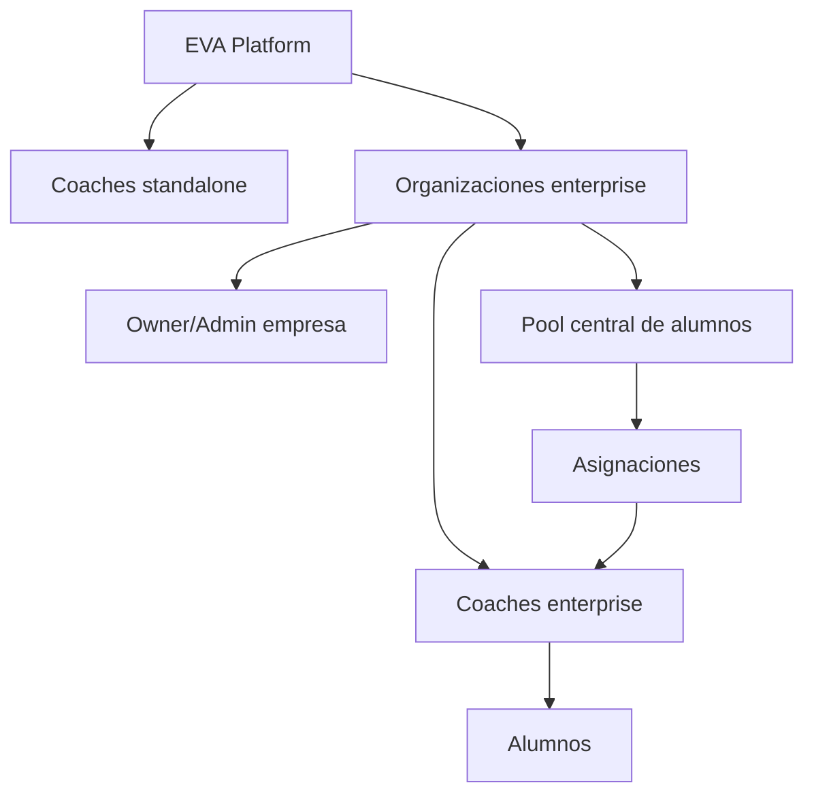
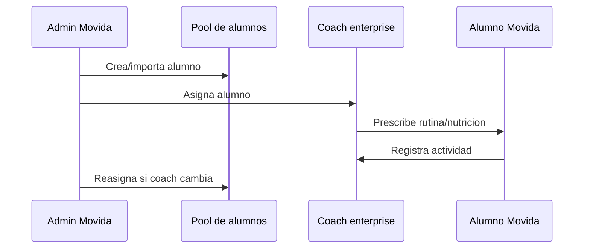

# EVA Enterprise Demo and Roadmap - Gimnasio Movida

> Version: 3.0  
> Fecha: 2026-05-20  
> Ambiente objetivo de pruebas: esta rama + Supabase local con Docker  
> Logo demo: `apps/web/public/logomovida.png` -> URL publica `/logomovida.png`

---

## 1. Vision Enterprise

EVA Enterprise no reemplaza EVA para coaches independientes. Es una capa adicional para gimnasios, boxes, centros de rendimiento y cadenas que necesitan controlar staff, alumnos, marca y continuidad operativa.

Modelo correcto:

La venta a Movida debe quedar simple:

- Movida paga a EVA por el servicio enterprise.
- Movida crea o invita coaches enterprise.
- Movida conserva la cartera y el historial de alumnos.
- Los coaches operan rutinas, nutricion y seguimiento.
- Los alumnos usan una experiencia web/PWA responsive bajo marca Movida.
- No se implementa ahora un flujo fintech para que Movida cobre a sus alumnos dentro de EVA.

---

## 2. Standalone vs Enterprise

| Area | Coach standalone | Coach enterprise |
|---|---|---|
| Cliente pagador | Coach paga a EVA | Empresa paga a EVA |
| Marca | Coach define logo/color | Hereda marca de la empresa |
| Billing | Ve `Suscripcion` | No ve billing propio |
| Marca propia | Ve `Mi Marca` | No ve `Mi Marca` |
| Alumnos | Le pertenecen al coach | Pertenecen al pool de la empresa |
| Asignaciones | Coach crea/gestiona directo | Admin empresa asigna alumnos |
| Salida de coach | Riesgo de perder cartera | Empresa reasigna alumnos |
| Dashboard empresa | No aplica | Owner/admin ve organizacion completa |

Regla de producto: `/coach/*` debe seguir funcionando para ambos tipos, pero con permisos y menus adaptados.

---

## 3. Estado Actual Detectado En Repo

App principal:

- Web: `apps/web`.
- Panel empresa existente: `apps/web/src/app/org/[slug]`.
- Rutas disponibles:
  - `/org/[slug]`
  - `/org/[slug]/coaches`
  - `/org/[slug]/clients`
  - `/org/[slug]/settings`
  - `/org/[slug]/onboarding`

Modelo DB enterprise existente:

- `organizations`
- `organization_members`
- `organization_invites`
- `coach_client_assignments`
- `org_audit_logs`
- `org_invoices`
- `payment_exceptions`
- `clients.org_id`
- `coaches.active_org_id`
- `coaches.subscription_status = 'org_managed'`

Seed local existente:

- Org A: `crossfit-test-norte`
- Owner: `coach-owner-a@eva-test.cl`
- Coach enterprise: `coach-member-a1@eva-test.cl`
- Alumno: `client-a1@eva-test.cl`
- Password general: `TestPass123!`

Gaps antes de demo:

- Login debia redirigir owner/admin enterprise a `/org/[slug]`.
- Coach enterprise no debe ver `Mi Marca` ni `Suscripcion`.
- Panel empresa existe, pero la demo debe narrarlo como producto enterprise, no como pagina interna.
- El SQL de demo debe convertir Org A en Movida usando `/logomovida.png`.

---

## 4. Demo Movida

### Identidad demo

- Nombre organizacion: `MOVIDA`
- Slug: `movida`
- Color primario: `#00B4D8`
- Color soporte: `#10B981`
- Logo: `/logomovida.png`
- Ambiente: Supabase local Docker

### Credenciales

| Rol | Email | Password | Ruta esperada |
|---|---|---|---|
| Owner/Admin Movida | `coach-owner-a@eva-test.cl` | `TestPass123!` | `/org/movida` |
| Coach enterprise | `coach-member-a1@eva-test.cl` | `TestPass123!` | `/coach/dashboard` |
| Alumno asignado | `client-a1@eva-test.cl` | `TestPass123!` | `/c/coach-a1-test/dashboard` |

### Guion de presentacion

1. Abrir `/login`.
2. Entrar como `coach-owner-a@eva-test.cl`.
3. Mostrar redireccion a `/org/movida`.
4. Presentar dashboard empresa:
   - coaches activos
   - seats
   - alumnos totales
   - alumnos activos
   - health score
   - estado del plan
5. Entrar a `Coaches`.
6. Mostrar staff Movida, roles y codigos de invitacion.
7. Entrar a `Clientes`.
8. Mostrar pool de alumnos.
9. Cambiar asignacion de un alumno a un coach.
10. Cerrar sesion.
11. Entrar como `coach-member-a1@eva-test.cl`.
12. Mostrar `/coach/dashboard`.
13. Destacar que el coach enterprise no ve `Mi Marca` ni `Suscripcion`.
14. Abrir alumnos/rutina/nutricion.
15. Mostrar vista alumno en viewport movil: `/c/coach-a1-test/dashboard`.
16. Cerrar con frase comercial:

> "Movida controla la cartera, la marca y la continuidad del servicio. Si un coach cambia de sede o se va, el alumno y su historial siguen dentro de Movida."

---

## 5. SQL Demo Movida

SQL canonico guardado aparte en `docs/MOVIDA_LOCAL_DEMO.sql`.

Resumen de lo que hace:

- Convierte `crossfit-test-norte` en `movida`.
- Usa `logo_url = '/logomovida.png'`.
- Ajusta color primario a `#00B4D8`.
- Personaliza nombres de owner, coaches y alumnos.
- Mantiene IDs de seed para no romper tests ni relaciones.
- Setea `last_health_score` para que el dashboard se vea vivo.

---

## 6. Arquitectura Enterprise

### Principios

- Multi-tenant por `org_id`.
- Standalone intacto: `clients.org_id IS NULL`.
- Enterprise: `clients.org_id IS NOT NULL`.
- Asignacion operacional: `coach_client_assignments`.
- Estado de coach enterprise: `subscription_status = 'org_managed'`.
- Billing enterprise separado de billing standalone.

### Propiedad de datos

En Enterprise, la organizacion es la propietaria operativa de la cartera. El coach enterprise tiene permisos de ejecucion sobre alumnos asignados, no propiedad comercial.

Esto es el argumento central para Movida:

- Menos riesgo si cambia el staff.
- Continuidad del historial fisico/nutricional.
- Control de calidad.
- Visibilidad del desempeno por coach.

---

## 7. Login Multi-Rol

Reglas post-login:

1. `org_owner` o `org_admin` activo con `active_org_id` -> `/org/[slug]`.
2. Coach enterprise con rol `coach` -> `/coach/dashboard`.
3. Coach standalone -> `/coach/dashboard`.
4. Alumno -> `/c/[coach_slug]/dashboard`.

Aplicaciones:

- Login email/password.
- OAuth Google.
- Redirect desde `/` cuando ya hay sesion.
- Auth pages cuando coach ya esta autenticado.

Decision de demo:

- Owner/admin Movida entra directo a panel empresa.
- Coach enterprise entra directo a panel coach.
- Alumno usa ruta white-label del coach.

---

## 8. Dashboard Empresa Ideal

El dashboard empresa debe sentirse como consola operacional B2B, no como landing.

KPIs prioritarios:

- Seats usados.
- Coaches activos.
- Invitaciones pendientes.
- Alumnos totales.
- Alumnos sin asignar.
- Alumnos activos.
- Alumnos en alerta.
- Health score organizacional.
- Ultima actividad del staff.

Acciones esperadas:

- Invitar coach.
- Crear coach enterprise.
- Agregar alumno.
- Asignar alumno.
- Reasignar alumnos de un coach.
- Revisar alertas.
- Contactar EVA para ampliar seats.

Menu objetivo:

- Dashboard
- Coaches
- Alumnos
- Asignaciones
- Reportes
- Branding
- Billing
- Auditoria

MVP actual puede mostrar menos menus, pero la propuesta debe mostrar esta direccion.

---

## 9. Pool Central De Alumnos

Flujo:

Reglas:

- Alumno enterprise siempre tiene `org_id`.
- Puede estar asignado a un coach o quedar temporalmente sin asignar.
- Coach solo ve alumnos asignados.
- Admin ve todo el pool.
- Reasignacion debe preservar historial completo.

Fase 1:

- Asignacion individual.
- Busqueda por nombre/email.
- Filtros basicos.

Fase 2:

- Bulk assign.
- Reasignacion masiva por salida de coach.
- Import CSV/Excel.
- Auditoria visible.

---

## 10. Coach Enterprise

El coach enterprise debe sentirse como EVA coach normal, pero con limites claros:

Debe ver:

- Dashboard.
- Alumnos asignados.
- Programas.
- Ejercicios.
- Nutricion.
- Soporte.
- Badge: `Gestionado por MOVIDA`.
- Link a panel empresa solo si tambien es admin/owner.

No debe ver:

- `Mi Marca`.
- `Suscripcion`.
- Upsells de planes individuales.
- Billing propio.

Razones:

- Billing lo administra Movida.
- Branding lo administra Movida.
- Evita confusion comercial.
- Refuerza control enterprise.

---

## 11. Branding Movida

Para la demo:

- Logo: `/logomovida.png`.
- Primary: `#00B4D8`.
- Accent: `#10B981`.
- UI: limpia, ejecutiva, con datos primero.

Reglas tecnicas:

- Renderizar variables de marca server-side para evitar FOUC.
- Usar `next/image` en mejoras futuras.
- Corregir `` existentes en panel org como deuda posterior.
- Mantener contraste en light/dark.

Mensaje comercial:

> "El alumno siente que esta usando la plataforma digital de Movida, no una herramienta generica."

---

## 12. Seguridad Y RLS

Controles esperados:

- RLS por organizacion.
- Coach enterprise no ve alumnos no asignados.
- Admin org no ve otra org.
- Service role solo en server actions controladas.
- Audit logs para cambios sensibles.
- Rate limit en auth y mutations.
- Nada de datos reales en demo.

Acciones auditables:

- `invite_coach`
- `remove_coach`
- `add_client`
- `assign_client`
- `bulk_reassign_clients`
- `update_org_branding`

Riesgos a testear antes de vender Enterprise:

- Cross-org data leak.
- Coach con dos orgs activas.
- Alumno reasignado que sigue visible para coach anterior.
- Invitaciones expiradas o reutilizadas.
- Upload de logo malicioso.

---

## 13. Legal Chile

Datos de peso, grasa corporal, progreso fisico, habitos y ficha de entrenamiento pueden ser datos sensibles.

Postura contractual:

- Movida: responsable del tratamiento.
- EVA: encargado del tratamiento.
- Alumno: consentimiento explicito e informado.

Debe existir:

- Politica de privacidad.
- Consentimiento de datos de salud/fitness.
- Mecanismo ARCO.
- DPA B2B.
- Retencion y eliminacion documentada.

Para la demo:

- No prometer compliance final.
- Decir: "El contrato enterprise incluye DPA y flujos de consentimiento del alumno."

---

## 14. Fintech Scope

No entra en MVP Movida:

- Wallet.
- Split payments.
- Cobro de Movida a alumnos desde EVA.
- Comisiones sobre membresias.
- Pasarela para alumno final.

Si entra:

- Movida paga a EVA por plan enterprise.
- Cobro manual MVP: transferencia/factura.
- MercadoPago enterprise futuro opcional.
- Facturacion SII manual al inicio.

Mensaje:

> "EVA no se mete todavia en la recaudacion de membresias de Movida. Primero resolvemos operacion, marca, staff y retencion."

---

## 15. Roadmap

### Fase 0 - Demo Movida

- Documento y SQL demo.
- Login owner/admin a `/org/movida`.
- Coach enterprise sin billing/marca.
- Branding Movida.
- Guion comercial.
- Screenshots fallback.

### Fase 1 - Enterprise MVP vendible

- Login multi-rol estable.
- Crear/invitar coaches enterprise.
- Pool de alumnos.
- Asignacion individual.
- Dashboard empresa con KPIs reales.
- Branding heredado por org.
- Billing manual.
- QA cross-org.

### Fase 2 - Enterprise Pro

- Reasignacion masiva.
- Reportes CSV/PDF.
- Audit log visible.
- Importacion CSV/Excel.
- Health score por coach.
- Alertas de alumnos inactivos.
- Onboarding guiado empresa.

### Fase 3 - Enterprise Scale

- SSO/SAML/OIDC.
- SCIM.
- Custom domains.
- SLA/status page.
- RBAC avanzado.
- Data export.
- Retention policies.
- App nativa EVA aggregator.

---

## 16. Aportes Por Rol

### Software Architect

- Enterprise convive con standalone.
- `org_id` es boundary multi-tenant.
- `/coach/*` no se duplica.
- Los permisos viven en DB/RLS y se reflejan en UI.

### Backend Engineer

- Queries especificas, no `select *`.
- Server Actions con Zod v4.
- `revalidatePath()` despues de mutations.
- Transaccion/RPC futura para reasignacion.
- Indices para busqueda en pool.

### Frontend Engineer

- Panel empresa operacional.
- UI responsive real.
- Variables de marca server-rendered.
- Corregir `` a `next/image` despues de demo.

### Mobile Engineer

- Para manana: PWA responsive.
- Futuro: app EVA aggregator.
- No prometer app dedicada inmediata.
- Deep links por coach/org en fase posterior.

### DevOps Engineer

- Demo corre local con Docker Supabase.
- Seed reproducible.
- Checklist antes de llamada.
- Screenshots fallback.

### QA Automation Engineer

- Smoke Playwright desktop/mobile.
- Login owner/coach/alumno.
- Cross-org RLS.
- Sidebar enterprise.
- Asignacion alumno.

### Security Engineer

- Sin datos reales.
- RLS cross-org.
- Audit logs.
- Upload logo validado.
- Service role encapsulado.

### Product Manager

- KPI central: adherencia/retencion.
- Dolor principal: no perder cartera por rotacion de coach.
- MVP: control, marca, asignacion, reporting.

### UX/UI Designer

- Densidad ejecutiva.
- Nada de hero marketing dentro del producto.
- Menus previsibles.
- Datos accionables.

### Head of Sales

- Vender control de cartera.
- Vender continuidad operativa.
- Vender marca Movida.
- Pricing por seats.

### SDR

- Abrir con demo personalizada.
- "Ya armamos como se veria Movida."
- Pedir reunion corta de 10-15 minutos.

### CSM

- Onboarding empresa en 7 dias.
- Capacitar coaches.
- Medir health score semanal.
- QBR trimestral.

### Legal Chile

- DPA B2B.
- Consentimiento datos sensibles.
- Derechos ARCO.
- Politica de privacidad.

### Fintech / Integrations

- Billing manual en MVP.
- MercadoPago/Fintoc/Khipu futuro.
- No cobrar alumnos en esta fase.

---

## 17. QA Plan

### Vitest

- `getPostLoginRedirect()`:
  - org owner -> `/org/[slug]`
  - org admin -> `/org/[slug]`
  - coach enterprise role coach -> `/coach/dashboard`
  - coach standalone -> `/coach/dashboard`
  - alumno -> `/c/[slug]/dashboard`
- `resolveCoachSubscriptionRedirect()`:
  - `org_managed` no bloquea acceso.
- Sidebar:
  - org managed oculta `Mi Marca` y `Suscripcion`.

### Playwright

- Login owner Movida -> `/org/movida`.
- Coach enterprise -> `/coach/dashboard`.
- Coach enterprise no ve `Mi Marca` ni `Suscripcion`.
- Standalone conserva menu completo.
- Admin asigna alumno.
- Coach no ve alumnos fuera de su asignacion.
- Alumno carga mobile viewport.

### Manual pre-demo

- `npm run dev`.
- Supabase local Docker arriba.
- SQL `docs/MOVIDA_LOCAL_DEMO.sql` aplicado.
- `/org/movida` carga logo.
- `/coach/dashboard` carga para coach enterprise.
- `/c/coach-a1-test/dashboard` carga en viewport movil.
- No errores visibles en consola durante rutas demo.

---

## 18. Checklist Pre-Demo

1. Confirmar rama correcta.
2. Confirmar Docker abierto.
3. Levantar Supabase local.
4. Aplicar migrations/seed si corresponde.
5. Aplicar `docs/MOVIDA_LOCAL_DEMO.sql`.
6. Confirmar `apps/web/public/logomovida.png`.
7. Ejecutar `npm run dev`.
8. Probar owner: `coach-owner-a@eva-test.cl`.
9. Probar coach: `coach-member-a1@eva-test.cl`.
10. Probar alumno: `client-a1@eva-test.cl`.
11. Sacar screenshots fallback:
    - `/org/movida`
    - `/org/movida/coaches`
    - `/org/movida/clients`
    - `/coach/dashboard`
    - `/c/coach-a1-test/dashboard` mobile

---

## 19. Fallback Si Algo Falla En Vivo

Si falla Supabase:

- Mostrar screenshots.
- Explicar que la demo corre sobre ambiente local con data falsa.
- Seguir guion comercial.

Si falla login:

- Ir directo a ruta ya autenticada si hay sesion.
- Tener navegador con tabs precargadas.

Si falla responsive:

- Mostrar desktop y screenshots mobile.

Si preguntan app nativa:

- Respuesta: "Hoy ya pueden usar PWA instalable. La app nativa EVA aggregator esta en roadmap Enterprise Pro; no bloquea la operacion inicial."

Si preguntan pagos alumno:

- Respuesta: "No entra en esta fase. EVA cobra a Movida por el servicio; no intervenimos aun la recaudacion de membresias."

---

## 20. Cierre Comercial

La demo debe vender tres ideas:

1. Control: Movida administra staff, alumnos y marca.
2. Continuidad: si un coach se va, el alumno y su historial quedan en Movida.
3. Profesionalizacion: cada alumno recibe una experiencia digital clara, instalable y con identidad Movida.

Frase final:

> "EVA Enterprise convierte el servicio de entrenamiento de Movida en un sistema digital propio: con su marca, su staff, sus alumnos y sus datos bajo control."
