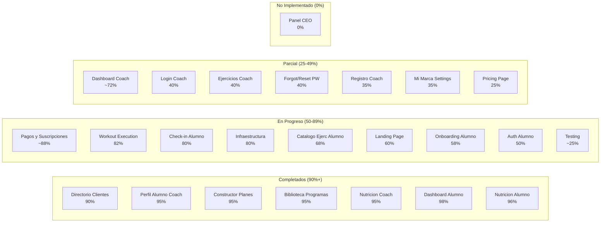
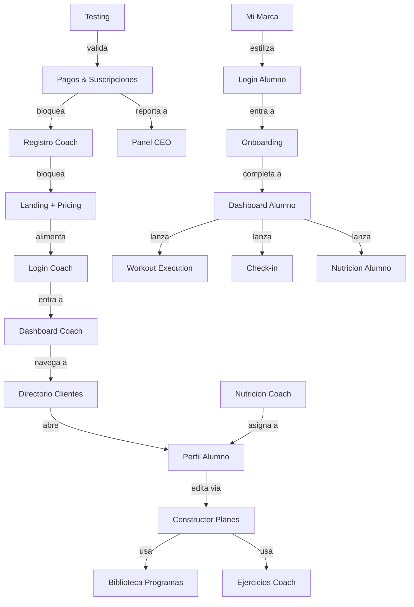

# Mapa Maestro — EVA Fitness Platform

> Radiografia completa de donde estamos y hacia donde vamos.
> **Generado:** 2026-04-10 America/Santiago — basado en auditoria de 225+ archivos, 24 tablas BD, 38 rutas.
> **Actualizado:** 2026-04-14 America/Santiago — 4 bugs cerrados: BUG-002/003 nutrición (quantity+unit toggle), BUG-004 alertas críticas alumnos nuevos, BUG-005 onboarding dismiss. Unidades g+un y seed 250 alimentos completados. % global ~76%.

---

## 1. Donde Estamos — Estado Actual por Modulo

### Mapa Visual de Completitud

### Tabla de Estado Detallada

| # | Modulo | % | Linea de Codigo | Archivos | Impacto en Revenue |
|---|--------|---|----------------|----------|-------------------|
| 1 | Dashboard Alumno | 98% | ~3,500 | 39 | Alto (retención) |
| 2 | Nutricion Alumno | 97% | ~1,200 | 12 | Alto (retención) |
| 3 | Constructor Planes | 95% | ~4,000 | 17 | Alto (valor coach) |
| 4 | Biblioteca Programas | 95% | ~1,800 | 9 | Medio (eficiencia coach) |
| 5 | Perfil Alumno Coach | 95% | ~5,000 | 40 | Alto (decisiones coach) |
| 6 | Nutricion Coach | 95% | ~3,000 | 24 | Alto (valor coach) |
| 7 | Directorio Clientes | 92% | ~3,500 | 15 | Alto (gestión) |
| 8 | Pagos & Suscripciones | **91%** | ~900+ | 11+ | **BLOQUEANTE** (monetización) |
| 9 | Workout Execution | **84%** ✅ | ~2,000 | 10 | **Critico** (core loop alumno) |
| 10 | Infraestructura | 80% | ~1,500 | 15 | Critico (base) |
| 11 | Check-in Alumno | **82%** | ~1,100 | 4 | Alto (seguimiento) |
| 12 | Catalogo Ejerc Alumno | 68% | ~500 | 3 | Bajo |
| 13 | Landing Page | 60% | ~970 | 1 | **Critico** (adquisición) |
| 14 | Onboarding Alumno | 58% | ~500 | 3 | Medio (activación) |
| 15 | Auth Alumno | 50% | ~400 | 6 | Medio |
| 16 | Dashboard Coach | ~72% | ~700 | 4+ | Alto (retención coach) |
| 17 | Ejercicios Coach | 40% | ~400 | 4 | Bajo |
| 18 | Login Coach | 40% | ~200 | 2 | Medio (adquisición) |
| 19 | Forgot/Reset PW | 40% | ~300 | 4 | Bajo |
| 20 | Mi Marca Settings | 62% | ~500 | 7 | Medio (diferenciación) |
| 21 | Registro Coach | 78% | ~480 | 4 | **Critico** (adquisición) |
| 22 | Pricing | 25% | ~200 | 1 | **Critico** (conversión) |
| 23 | **BD Alimentos 250+** | seed (54 now) | — | 1 migración | Alto (nutrición) |
| 24 | **Historial fecha coach** | 0% | — | 3-4 archivos | Alto (analytics coach) |
| 25 | **Tabs optimización perfil** | 0% | — | 3 archivos | Medio (UX) |
| 26 | Panel CEO | 0% | 0 | 0 | Alto (operaciones) |
| 27 | Testing | ~28% | — | 10+ archivos test | Critico (calidad) |

**TOTAL ESTIMADO: ~75%** (alineado con [`ESTADO-COMPONENTES.md`](ESTADO-COMPONENTES.md))

---

## 2. Metricas de la Base de Codigo

| Metrica | Valor |
|---------|-------|
| Archivos TypeScript/TSX | 225+ |
| Tablas Supabase | 24 |
| Rutas (pages) | 38 |
| API Routes (`src/app/api/**/route.ts`) | 11+ |
| Layouts | 4 |
| Loading states | 11 |
| Componentes UI (shadcn) | 25+ |
| Componentes compartidos | 53 |
| Dependencias production | ~35 |
| Dependencias dev | 17 |
| Unit / integration (Vitest) | 30+ casos en varios archivos (`*.test.ts`) |
| E2E (Playwright) | 5+ specs (`tests/*.spec.ts`) |
| Idiomas soportados | 2 (es, en) parcial |

---

## 3. Mapa de Dependencias entre Modulos

---

## 4. Camino Critico hacia Monetizacion

El camino critico es la secuencia minima de trabajo que desbloquea ingresos:

```mermaid
graph LR
    A["1. Definir tiers + moneda<br/>(Producto, 1 dia)"] --> B["2. Integrar MercadoPago<br/>(Backend, 5-7 dias)"]
    B --> C["3. Flujo registro+pago<br/>(Fullstack, 3-4 dias)"]
    C --> D["4. Webhooks suscripcion<br/>(Backend, 2-3 dias)"]
    D --> E["5. Control acceso por tier<br/>(Fullstack, 2-3 dias)"]
    E --> F["6. Alinear landing+pricing<br/>(Frontend, 2-3 dias)"]
    F --> G["7. QA + fix bugs criticos<br/>(QA, 3-5 dias)"]
    G --> H["8. LANZAMIENTO BETA<br/>Coach real + alumnos"]
```

**Estimacion total camino critico: 18-26 dias de desarrollo**

---

## 5. Hacia Donde Vamos — Fases del Producto

### Fase 0: Pre-Revenue (ACTUAL — ~72%)
> Producto funcional para demos y beta. **Pagos Mercado Pago** (preapproval + webhooks + gating) implementados; falta operación estable en producción y más cobertura de tests.

**Logros:**
- Core loop completo: coach crea programa → alumno ejecuta → coach revisa
- Nutricion end-to-end: plan → asignacion → tracking alumno
- Dashboard alumno premium (compliance, PRs, streaks, nutricion)
- Directorio coach con attention scores y War Room
- PWA funcional (instalar, branding por coach)
- Suscripción coach: API `/api/payments/*`, middleware, `subscription_events`, estado `trialing` en BD

**Gaps criticos:**
- Moneda landing vs `/pricing` (CLP vs USD) pendiente de alineación
- Cobertura de tests aún baja para confianza plena en producción

---

### Fase 1: Revenue MVP (~75%)
> Primer coach real pagando. Monetizacion basica operativa.

**Objetivos:**
- MercadoPago integrado (Chile, CLP)
- Registro coach con pago obligatorio
- Landing/Pricing alineados en CLP
- Control de acceso por tier de suscripcion
- Dashboard coach mejorado (KPIs utiles)
- Testing minimo viable (flujos criticos)
- Fix de bugs bloqueantes

**KPIs de exito:**
- 1+ coach pagando
- 0 errores criticos en flujo de pago
- Flujo registro→pago <3 minutos

---

### Fase 2: Product-Market Fit (~80%)
> 10+ coaches activos. Validacion del modelo.

**Objetivos:**
- Dashboard coach reworkeado (War Room style, tendencias)
- Mi Marca mejorado (mas opciones, preview actualizado)
- Workout execution pulido (offline, vibration, batch logging)
- Check-in completo (medidas, notas, mas fotos)
- Onboarding alumno refinado
- Panel CEO basico (MRR, coaches, churn)
- Notificaciones (email transaccional minimo)

**KPIs de exito:**
- 10+ coaches pagando
- Retention coach mes 2 > 60%
- NPS coach > 40

---

### Fase 3: Growth (~88%)
> Escalar adquisicion. 50+ coaches.

**Objetivos:**
- Push notifications (PWA + servidor)
- Email marketing automatizado
- Gamificacion avanzada (logros, leaderboards)
- i18n completo (toda la app en es + en)
- SEO tecnico + ASO
- Programa de referidos coach-to-coach
- API publica para integraciones

**KPIs de exito:**
- 50+ coaches pagando
- CAC < CLP 50.000
- LTV/CAC > 3

---

### Fase 4: Scale (~95%)
> Optimizar para volumen. 200+ coaches.

**Objetivos:**
- App movil nativa (Capacitor o React Native)
- Offline-first completo
- CDN + edge caching
- Multi-region Supabase
- Marketplace de templates
- Integraciones wearables (Apple Health, Google Fit)
- Compliance GDPR / ley chilena de proteccion de datos

**KPIs de exito:**
- 200+ coaches
- MRR > CLP 5M
- Uptime 99.9%

---

## 6. Riesgos Principales

| Riesgo | Probabilidad | Impacto | Mitigacion |
|--------|-------------|---------|------------|
| No monetizar a tiempo (cash runway) | Alta | Critico | Fase 1 como prioridad absoluta |
| Migraciones SQL perdidas (schema drift) | Media | Alto | `supabase db pull` inmediato, workflow de migraciones |
| Performance con muchos coaches (queries N+1) | Media | Alto | React.cache, indexes, monitoreo |
| PWA limitada vs apps nativas (percepcion) | Media | Medio | Offline basico, push notifications, A2HS optimizado |
| Seguridad RLS no validada formalmente | Alta | Critico | Test E2E RLS antes de produccion |
| Competencia (Trainerize, TrueCoach, etc.) | Alta | Alto | Diferenciacion: white-label + mercado Chile/LATAM |
| Un solo developer (bus factor = 1) | Alta | Critico | Documentacion, tests, codigo limpio |

---

## 7. Quick Wins (alto impacto, bajo esfuerzo)

Estado revisado contra el repo (no solo el plan original).

| # | Quick Win | Estado | Notas |
|---|-----------|--------|-------|
| 1 | Crear `.env.example` | **Hecho** | Raíz del repo, alineado con README y vars usadas en código |
| 2 | Borrar `ClientCard.tsx` V1 | **Hecho** | Archivo ya no existe; directorio usa `ClientCardV2` |
| 3 | Auth callback (`/login` en error) | **Hecho** | `src/app/auth/callback/route.ts` → `/login?error=auth_callback_failed` |
| 4 | Cache `sw.js` (`eva`) | **Hecho** | `public/sw.js` → `eva-pwa-cache-v1` |
| 5 | `LIBRARY_PROGRAM_LIST_SELECT` | **Hecho** | Import único desde `workout-programs-library.ts` |
| 6 | `puppeteer` en devDependencies | **Hecho** | `package.json` |
| 7 | `font-outfit` / tipografía alumno | **Hecho** | Login, change-password, exercises, suspended: clase `font-display` |
| 8 | Migraciones SQL en repo | **Hecho (seguimiento)** | `supabase/migrations/` + `migrations_backup/`; disciplina: commitear cada cambio aplicado en prod |

**Documentación:** los 5 `.md` canónicos viven en `docs/`; runbooks y sprints en `docs/archive/` (ver `docs/archive/README.md`).

---

## 8. Resumen Ejecutivo

**EVA** es una plataforma SaaS de fitness coaching con un **core product solido al ~72%**. Los modulos de mayor valor (constructor de planes, dashboard alumno, nutricion, directorio con attention scores) estan al **90-98%** de completitud y representan una ventaja competitiva real.

**Monetización:** integración **Mercado Pago** (checkout recurrente, webhooks, reactivate/processing) está en producción técnica; el foco pasa a **Go/No-Go**: variables de entorno en prod, webhooks firmados/token, smoke en sandbox, y alinear pricing/landing.

**Siguiente paso inmediato:** operar Fase 1 (Revenue MVP) — validar cobros reales, monitoreo, y cierre de UX comercial (pricing unificado, tests E2E de pago con credenciales).

**Ventaja competitiva:** White-label real (cada coach tiene su propia "app" con su marca), mercado Chile/LATAM desatendido por competidores anglosajones, stack moderno (Next.js 16, RSC, Supabase), UX premium en los modulos completados.
