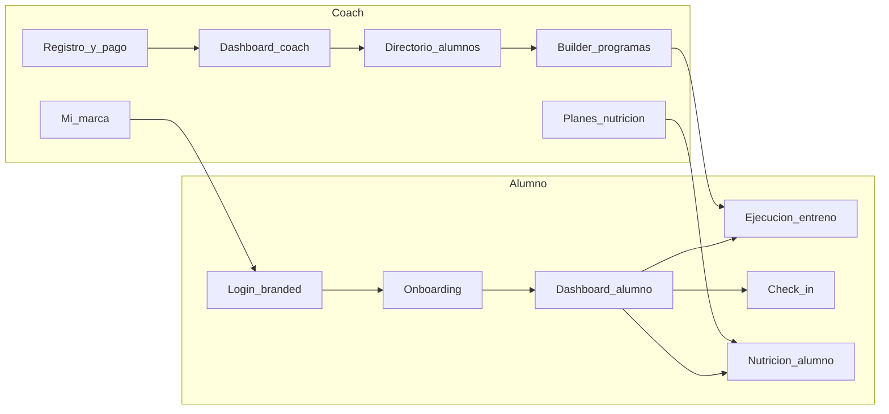
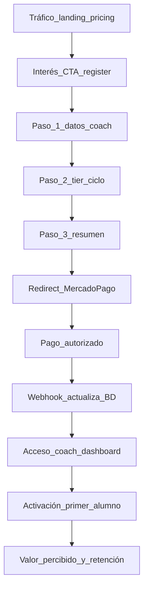
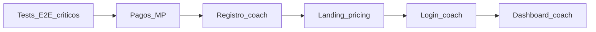
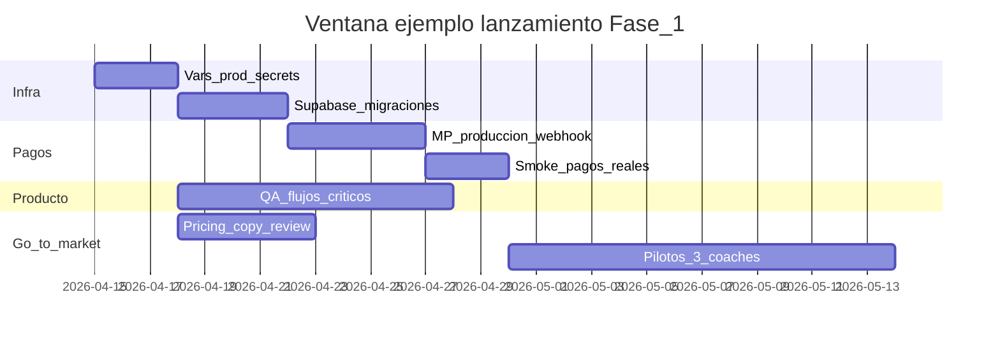
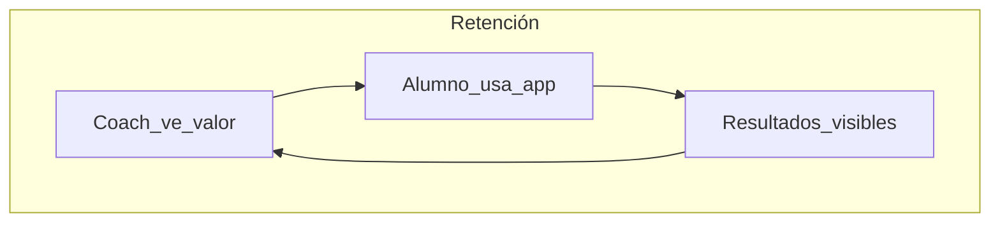

# Planificación Empresa — EVA Fitness Platform

> Manual de negocio, lanzamiento, métricas monetarias, retención y operación continua post-lanzamiento.  
> **Última actualización:** 2026-04-14 America/Santiago  
> **Fuentes canónicas del repositorio:** [`ARQUITECTURA-COMPONENTES.md`](ARQUITECTURA-COMPONENTES.md), [`ESTADO-COMPONENTES.md`](ESTADO-COMPONENTES.md), [`ESTADO-PROYECTO.md`](ESTADO-PROYECTO.md), [`MAPA-MAESTRO.md`](MAPA-MAESTRO.md), [`PLAN-MAESTRO-ESTRATEGICO.md`](PLAN-MAESTRO-ESTRATEGICO.md).  
> **Fuente de verdad comercial (precios y tiers):** [`src/lib/constants.ts`](../src/lib/constants.ts), [`src/app/pricing/page.tsx`](../src/app/pricing/page.tsx).

---

## Tabla de contenidos

1. [Resumen ejecutivo](#1-resumen-ejecutivo)  
2. [Contexto del producto y posicionamiento](#2-contexto-del-producto-y-posicionamiento)  
3. [Oferta, tiers y packaging](#3-oferta-tiers-y-packaging)  
4. [Economía del negocio y escenarios monetarios](#4-economía-del-negocio-y-escenarios-monetarios)  
5. [Go-to-market y proceso de venta](#5-go-to-market-y-proceso-de-venta)  
6. [Lanzamiento técnico y operativo](#6-lanzamiento-técnico-y-operativo)  
7. [Métricas, cohortes y analítica](#7-métricas-cohortes-y-analítica)  
8. [Retención B2B y B2B2C](#8-retención-b2b-y-b2b2c)  
9. [Soporte, comunicación y reputación](#9-soporte-comunicación-y-reputación)  
10. [Riesgos, cumplimiento y continuidad](#10-riesgos-cumplimiento-y-continuidad)  
11. [Trabajo en el producto después del lanzamiento](#11-trabajo-en-el-producto-después-del-lanzamiento)  
12. [Organización interna y gobernanza](#12-organización-interna-y-gobernanza)  
13. [Anexo A — Calendario operativo 0–90 días (semanal)](#anexo-a--calendario-operativo-090-días-semanal)  
14. [Anexo B — Checklists maestros pre y post lanzamiento](#anexo-b--checklists-maestros-pre-y-post-lanzamiento)  
15. [Anexo C — Scripts de demo, objeciones y correos](#anexo-c--scripts-de-demo-objeciones-y-correos)  
16. [Anexo D — Modelo manual de MRR en hoja de cálculo](#anexo-d--modelo-manual-de-mrr-en-hoja-de-cálculo)  
17. [Anexo E — Eventos de producto y analítica deseables](#anexo-e--eventos-de-producto-y-analítica-deseables)  
18. [Anexo F — Glosario extendido y FAQ interno](#anexo-f--glosario-extendido-y-faq-interno)  

---

## Glosario corto (lectura rápida)

| Término | Definición operativa |
|--------|----------------------|
| **EVA** | Plataforma SaaS white-label para coaches: programas, nutrición (según tier), progreso y app alumno con marca del coach. |
| **MRR** | Ingreso recurrente mensual normalizado (suscripciones mensuales + parte mensual equivalente de ciclos trimestrales/anuales). |
| **ARPA** | MRR dividido por número de cuentas coach de pago activas. |
| **Churn (coach)** | Coaches que dejan de renovar o pasan a estado bloqueante de suscripción. |
| **Grace period (cancelación)** | Tras cancelar renovación, el coach conserva acceso hasta `current_period_end` (implementado Sprint 8). |
| **Upgrade mid-cycle** | Cambio de plan con inicio del nuevo cobro al término del ciclo vía `start_date` en Mercado Pago (Sprint 8). |
| **B2B2C** | EVA cobra al coach; el alumno usa la app por relación con el coach. |
| **PWA** | App instalable por coach (`/c/[coach_slug]` + manifest dinámico). |
| **RLS** | Row Level Security en Supabase: crítico antes de escalar tráfico. |

---

## 1. Resumen ejecutivo

EVA es una plataforma **SaaS en pesos chilenos (CLP)** orientada a **coaches de fitness en Chile y LATAM**, con **marca blanca** (logo, color, mensaje de bienvenida), **constructor de planes**, **nutrición** en tiers superiores, y **experiencia alumno** fuerte (dashboard, nutrición, check-in, ejecución de entreno). El estado global del código se sitúa en torno al **~82%** de completitud respecto a la visión documentada en [`MAPA-MAESTRO.md`](MAPA-MAESTRO.md), con **pagos y suscripción** muy avanzados (**~96%** en el mapa) e integración **Mercado Pago** operativa en flujo de registro, preferencias, webhooks y gating en middleware.

**Objetivo empresarial inmediato (Fase 1 — Revenue MVP):** validar **cobro real** con credenciales de producción, smoke test de **webhook** y operación sin errores críticos en el camino **registro → checkout → acceso coach**. El siguiente escalón (Fase 2 — PMF) es **10+ coaches pagando**, con retención de coach mes 2 **>60%** y **NPS coach >40**, según KPIs del mapa maestro.

**Qué hace falta para “lanzar” en sentido estricto:** no es solo publicar la URL: es **cerrar el ciclo comercial completo** (marketing → demo → pago → activación de alumnos → uso recurrente) bajo **control de riesgos** (RLS, migraciones, monitoreo de pagos, soporte). Este documento detalla **cómo**, **cuándo ver resultados de ventas**, **cómo medir dinero y retención**, y **qué construir después** alineado a la deuda listada en [`ESTADO-COMPONENTES.md`](ESTADO-COMPONENTES.md).

**Sincronización con el estado del repo (referencia abril 2026):** completitud global ~**82%** ([`MAPA-MAESTRO.md`](MAPA-MAESTRO.md)); **pagos y suscripción ~96%**; **testing ~28%**; **Panel CEO 0%**; **onboarding alumno ~58%**; **landing ~72–75%**; **pricing ~78%**; **login coach ~40%** — usar esas cifras como **riesgo explícito** al fijar expectativas con inversionistas o pilotos (no prometer pulido total donde aún hay deuda UX).

---

## 2. Contexto del producto y posicionamiento

### 2.1 Visión y propuesta de valor

Síntesis alineada a [`PLAN-MAESTRO-ESTRATEGICO.md`](PLAN-MAESTRO-ESTRATEGICO.md):

- **White-label real:** cada coach expone su espacio bajo `/c/[coach_slug]` con variables de tema y branding desde BD.
- **Mercado desatendido:** competidores anglosajones dominan con USD y menor foco en español y realidad LATAM.
- **Stack moderno:** Next.js (App Router, RSC, Server Actions), Supabase (Auth, DB, Storage, RLS), despliegue típico en Vercel u homólogo — permite iteración rápida post-lanzamiento.

### 2.2 Personas

1. **Coach (pagador):** PT independiente o dueño de box pequeño; 10–50 alumnos típicos; dolor: WhatsApp + hojas dispersas; busca profesionalización y marca propia.  
2. **Alumno (usuario final):** no paga EVA directamente; busca claridad de qué entrenar y registrar progreso en móvil.  
3. **Fundador / operaciones:** necesita visibilidad de MRR, churn y salud de plataforma — hoy el **Panel CEO está al 0%** (ver ESTADO-COMPONENTES); hasta construirlo, las métricas son **manuales o vía SQL**.

### 2.3 Competencia (recordatorio estratégico)

| Dimensión | EVA | Nota operativa |
|-----------|-----|----------------|
| White-label / PWA | Sí | Argumento de venta fuerte en demos en vivo con logo del prospecto. |
| Nutrición integrada | Sí (Pro+) | Diferenciar en pitch frente a herramientas “solo gym”. |
| App nativa | No (PWA) | Objeción frecuente: contrarrestar con instalación A2HS y velocidad de mejora. |
| Pagos integrados | Mercado Pago (Chile) | Ventaja local vs. stacks solo Stripe USD. |

### 2.4 Diagrama — Core loop producto (coach ↔ alumno)

Este loop es el **corazón del valor** y debe ser el **eje de la demo** y del **onboarding** del coach.

---

## 3. Oferta, tiers y packaging

Los valores siguientes provienen de `TIER_CONFIG`, `TIER_ALLOWED_BILLING_CYCLES`, `getTierCapabilities` y `getTierPriceClp` en [`src/lib/constants.ts`](../src/lib/constants.ts). Los importes trimestrales y anuales aplican **descuento del 10% sobre 3 meses** y **20% sobre 12 meses** respectivamente (redondeo `Math.round` en código).

### 3.1 Tabla maestra de tiers (CLP)

| Tier | Etiqueta | Alumnos máx. | Rango marketing | Precio mensual CLP | Ciclos permitidos | Nutrición |
|------|----------|--------------|-----------------|--------------------|-------------------|-----------|
| `starter_lite` | Starter Lite | 5 | 1–5 | **7.990** | Solo mensual | No |
| `starter` | Starter | 10 | 6–10 | **19.990** | Solo mensual | No |
| `pro` | Pro | 30 | 11–30 | **29.990** | Solo mensual | Sí |
| `elite` | Elite | 60 | 31–60 | **44.990** | Trimestral o anual | Sí |
| `scale` | Scale | 100 | 61–100 | **64.990** | Trimestral o anual | Sí |

**Precio por ciclo (referencia calculada con la misma lógica que el código):**

| Tier | Mensual | Trimestral (factura única, −10% vs 3×mensual) | Anual (−20% vs 12×mensual) |
|------|---------|-----------------------------------------------|----------------------------|
| starter_lite | 7.990 | *no aplica* | *no aplica* |
| starter | 19.990 | *no aplica* | *no aplica* |
| pro | 29.990 | *no aplica* | *no aplica* |
| elite | *no mensual en app* | **121.473** | **431.904** |
| scale | *no mensual en app* | **175.473** | **623.904** |

> Nota comercial: Elite y Scale **no ofrecen mensual** en configuración actual; el pitch debe ser coherente con [`/pricing`](../src/app/pricing/page.tsx) para no prometer facturación mensual en esos niveles.

### 3.2 Features compartidas (copy de producto)

Según `SHARED_TIER_FEATURES` en código: rutinas con GIFs, catálogo de ejercicios, programas, check-in y progreso, dashboard coach, branding personalizado. **Nutrición** se añade explícitamente desde **Pro** en `TIER_CONFIG.features` y `canUseNutrition`.

### 3.3 Empresarial (>100 alumnos)

La landing y pricing ya invitan a contactar **contacto@eva-app.cl** para planes empresariales. Operativamente: definir **precio custom**, **SLA**, **facturación** (transferencia / contrato / MP con monto custom) y **límites** fuera del `maxClients` estándar.

### 3.4 Mensajes por segmento

- **Coach con pocos alumnos y sin nutrición:** Starter Lite / Starter — bajo ticket, mensual simple.  
- **Coach con nutrición o intención de escalar:** Pro — “sweet spot” en pricing page.  
- **Box mediano / muchos alumnos:** Elite o Scale — prepago trimestral/anual mejora cashflow y reduce churn involuntario por tarjeta mensual.  
- **Gimnasio / franquicia:** Empresarial — multi-coach, reporting, posible SSO en roadmap lejano (no prometido hoy).

---

## 4. Economía del negocio y escenarios monetarios

### 4.1 Definiciones

- **MRR (informal manual):** suma de lo que “percepción mensual” aporta cada coach. Para **trimestral/anual**, dividir el cobro por 3 o 12 (o usar reconocimiento contable según asesoría).  
- **Expansión revenue:** upgrade de tier o más alumnos acercándose al tope → upsell al siguiente tier.  
- **Contracción:** downgrade o cancelación al fin de período.  
- **Churn logo:** coach que deja de pagar o cae en estado bloqueante (`pending_payment`, `expired`, `past_due`, `paused` según `SUBSCRIPTION_BLOCKED_STATUSES` en constants — **nota:** `canceled` ya no bloquea si aún hay `current_period_end` futuro).

### 4.2 Cuándo “ver ventas” (expectativas de tiempo)

| Hito | Horizonte típico | Comentario |
|------|------------------|-------------|
| Primera compra real | Día 0–14 post “go live” comercial | Depende de pipeline caliente (lista de espera, beta). |
| Primer mes con MRR “no trivial” | 30–45 días | Requiere 5–15 conversaciones serias y demos. |
| Validación de que el embudo funciona | 60 días | Medir conversión visita pricing → registro → pago. |
| Fase 2 (10+ coaches pagando) | 3–9 meses | MAPA: PMF; requiere GTM consistente + producto estable. |

Estos plazos son **orientativos**; el documento de estado del proyecto asume **Fase 0 pre-revenue completada** en términos de producto y pone **Fase 1** como foco inmediato.

### 4.3 Escenarios de MRR ilustrativos (supuestos)

**Convención:** solo cuentas **coach de pago activo**; MRR mensual = suma de precios mensuales equivalentes.

**Escenario conservador (mes 3):** 4 coaches: 2×Starter Lite, 1×Starter, 1×Pro.  
MRR ≈ 2×7.990 + 19.990 + 29.990 = **73.960 CLP/mes**.

**Escenario base (mes 6):** 12 coaches: 3 Lite, 4 Starter, 3 Pro, 1 Elite anual prorrateado (~35.992/mes equivalente), 1 Scale anual prorrateado (~51.992/mes).  
MRR aproximado lineal (sin contar descuentos anuales finos): 3×7.990 + 4×19.990 + 3×29.990 + 35.992 + 51.992 ≈ **23.970 + 79.960 + 89.970 + 87.984 = 281.884 CLP/mes**.

**Escenario agresivo (mes 12):** 35 coaches con mezcla 20% Lite, 25% Starter, 35% Pro, 12% Elite (ciclo largo), 8% Scale (ciclo largo). ARPA sube por nutrición y tiers altos. Útil como **techo de planificación** si el GTM incluye boxes y nutricionistas.

### 4.4 Unit economics (esqueleto)

- **CAC:** costo de adquirir un coach (ads + tiempo comercial). MAPA Fase 3 menciona objetivo **CAC < CLP 50.000** (contexto de escala).  
- **LTV (orden de magnitud):** ARPA × meses de vida media. Ej.: ARPA 25.000 y 14 meses de retención → LTV ~350.000.  
- **LTV/CAC:** ratio saludable **>3** en SaaS B2B SMB cuando CAC está bien medido.

### 4.5 Diagrama — Embudo comercial simplificado

---

## 5. Go-to-market y proceso de venta

### 5.1 Canales sugeridos (etapa Fase 1)

1. **Red propia y referrals** — costo marginal bajo.  
2. **Outbound a gimnasios y boxes** — demo presencial o videollamada con PWA instalada.  
3. **Alianzas con nutricionistas** — bundles Pro+ (nutrición real en producto).  
4. **Contenido educativo** — reels/shorts “cómo dejar de mandar PDFs por WhatsApp”.  
5. **Programa piloto** — 3–5 coaches con condición clara: feedback semanal + testimonio si funciona.

### 5.2 Proceso de venta B2B (pasos)

1. **Calificación:** nº alumnos, uso actual de herramientas, necesidad nutrición, disposición a pagar SaaS.  
2. **Demo de 20 min:** core loop (crear alumno → asignar programa → log alumno); mostrar **Mi Marca** y **War Room** si el perfil es gestión.  
3. **Propuesta de tier:** alinear a límites `maxClients` para evitar frustración inmediata.  
4. **Prueba guiada (opcional):** en MVP actual el registro va a pago; valorar **cupos de trial** solo como política comercial excepcional si el producto lo soporta (`trialing` existe en BD según estado del proyecto).  
5. **Cierre:** envío a `/register` con `?tier=` si se implementa en CTAs (PLAN MAESTRO ENG-021).  
6. **Onboarding:** checklist interna primeras 48 h (Anexo A semana 1).

### 5.3 Material mínimo de ventas

- Capturas o video vertical del **dashboard alumno**.  
- One-pager PDF con precios alineados a `/pricing`.  
- FAQ sobre **cancelación con acceso hasta fin de período** y **cambio de plan sin doble cobro** (coherente con Sprint 8).

---

## 6. Lanzamiento técnico y operativo

### 6.1 Dependencias críticas (diagrama)

Interpretación: sin **pagos estables**, el registro comercial no cierra; sin **landing clara**, baja conversión; **tests** dan confianza para tocar producción.

### 6.2 Timeline tipo — Fase 1 “go live” (2–4 semanas calendario)

### 6.3 Checklist técnica resumida (detalle en Anexo B)

- **Supabase:** migraciones aplicadas en prod; RLS revisado en tablas sensibles; backups.  
- **App:** variables de entorno producción; dominio; TLS; revisión `middleware` y `coach-subscription-gate` con `current_period_end`.  
- **Mercado Pago:** credenciales prod; URL webhook; token obligatorio en prod (según ESTADO-PROYECTO); prueba de firma HMAC opcional.  
- **Post-deploy:** smoke `register → processing → return`; alumno login en slug real; un **log de set** y un **check-in** en prod.

### 6.4 Día 0–7 post lanzamiento

- Monitor de errores (Vercel logs / Sentry si existe).  
- Revisión diaria de tabla `subscription_events` o equivalente en BD.  
- Canal único de soporte (correo) con **plantillas** (Anexo C).  
- Reunión interna 30 min: “qué se rompió / qué aprendimos”.

---

## 7. Métricas, cohortes y analítica

### 7.1 North Star sugerida (hasta Panel CEO)

**“Sesiones de entrenamiento con al menos un set logueado por semana, por coach activo”** — conecta valor alumno + retención coach. Alternativa: **alumnos activos semanales** por coach.

### 7.2 Métricas por fase (alineación MAPA)

| Fase | Métricas mínimas |
|------|------------------|
| Fase 1 | 1+ coach pagando; 0 errores críticos en pago; tiempo registro→pago <3 min. |
| Fase 2 | 10+ coaches; retención mes 2 >60%; NPS >40. |
| Fase 3 | 50+ coaches; CAC <50k CLP; LTV/CAC >3. |
| Fase 4 | 200+ coaches; MRR >5M CLP; uptime 99.9%. |

### 7.3 Cohortes coach (manual)

Columnas sugeridas por cohorte mensual de signup: `signup_date`, `tier`, `paid_yn`, `d7_active`, `d30_active`, `churned_m2`, `reason_churn` (entrevista).

### 7.4 Activación coach (definición operativa)

1. Cuenta creada y pago OK.  
2. **≥1 alumno** creado en directorio.  
3. **≥1 programa** asignado o plan visible en alumno.  
4. **≥1 log** de entrenamiento por un alumno en 14 días.

### 7.5 Activación alumno

1. Onboarding completado (`onboarding_completed` — flujo en ~58% madurez UX según ESTADO-COMPONENTES).  
2. Primer **workout** con log.  
3. Primer **check-in** en 30 días (opcional pero deseable para adherencia).

---

## 8. Retención B2B y B2B2C

### 8.1 Retención del coach (paga la suscripción)

**Palancas:** ahorro de tiempo (directorio + builder), profesionalización (branding), resultados visibles de alumnos (adherencia, PRs), políticas de pago justas (grace, upgrade sin doble cobro — reduce fricción psicológica).

**Señales de riesgo:** coach sin crear alumnos en 7 días; todos los alumnos inactivos 14 días; tickets repetidos de “no entiendo el pago”; uso cero de nutrición en tier Pro+.

### 8.2 Retención del alumno (B2B2C)

El coach renueva si sus alumnos **usan** la app. Palancas: dashboard atractivo, nutrición usable, check-in recordatorios (emails transaccionales existen en templates según ESTADO-PROYECTO), menos fricción en ejecución de entreno (workout ~84% — seguir mejorando).

### 8.3 Flywheel (diagrama)

---

## 9. Soporte, comunicación y reputación

- **Canal principal:** contacto@eva-app.cl (visible en pricing/landing).  
- **SLA sugerido Fase 1:** primera respuesta <24 h hábil; resolución P0 pagos <4 h cuando sea posible.  
- **Clasificación:** P0 pago/acceso; P1 bug bloquea entreno; P2 UX; P3 idea.  
- **Reputación:** política de no debatir en público threads largos; mover a email; documentar bugs y cerrar loop.

---

## 10. Riesgos, cumplimiento y continuidad

### 10.1 Riesgos del MAPA (acciones mitigantes)

| Riesgo | Mitigación operativa |
|--------|----------------------|
| No monetizar a tiempo | Priorizar Fase 1; recortar scope no P0. |
| Schema drift / migraciones | Disciplina: solo migraciones versionadas en repo; `supabase db pull` si aplica. |
| Performance | `React.cache`, índices, monitoreo de queries pesadas. |
| PWA vs nativa | Roadmap honesto; mejoras offline/push en fases posteriores. |
| RLS no validado | E2E RLS antes de escalar marketing de pago. |
| Bus factor = 1 | Documentación, runbooks (este doc), tests. |

### 10.2 Chile / legal

- Mantener **Términos** y **Privacidad** enlazados (`/legal`, `/privacidad`).  
- Límites por tier y uso aceptable (referencia PLAN MAESTRO LEG-004).  
- Facturación B2B: criterio contable con asesor; MP entrega comprobantes según configuración de cuenta MP.

---

## 11. Trabajo en el producto después del lanzamiento

### 11.1 Prioridades alineadas a documentos de estado

**P0 / inmediato post-lanzamiento comercial**

- Smoke **webhook Mercado Pago** en producción con eventos reales.  
- Completar **TASK-P2.4** (webhook activación upgrade) cuando aplique — pendiente citado en MAPA/ESTADO.  
- Aumentar **cobertura de tests** (hoy ~28% área testing en MAPA — objetivo subir con flujos críticos).

**P1 — Primeros 10 coaches**

- **UX-003** Login coach visual premium.  
- **UX-006** Onboarding alumno: progress bar, menos saltos bruscos.  
- **UX-005** Preview Mi Marca alineado al dashboard alumno real.  
- **Panel CEO** (0%): mínimo viable con MRR manual + listado coaches desde SQL o ruta interna protegida.

**P2 — Retención y profundidad**

- Push / PWA notifications (fases MAPA 3–4).  
- i18n completo.  
- Mejoras workout: scroll por bloque, vibración, optimistic UI.  
- Check-in: medidas corporales, notas (PLAN MAESTRO UX-008).

### 11.2 Ritmo de ingeniería sugerido

- Release **semanal** o quincenal con notas breves para pilotos.  
- **Congelar features** 48 h antes de campaña de marketing grande.  
- Postmortem en cualquier incidente P0 de pagos.

---

## 12. Organización interna y gobernanza

### 12.1 RACI mínimo (ejemplo dos fundadores)

| Actividad | Responsable | Aprobador | Consultado | Informado |
|-----------|-------------|-----------|------------|-----------|
| Deploy producción | Tech founder | Ops founder | — | Pilotos |
| Pricing / tiers | Ops founder | Tech founder | — | Todos |
| Soporte día a día | Rotación | — | Tech | Clientes |
| Contenido marketing | Ops | — | Tech | — |

### 12.2 Ceremonias

- **Semanal 60 min:** métricas embudo + top 3 bugs + top 3 ventas.  
- **Mensual:** revisión de churn y decisión de roadmap siguiente mes.

---

## Anexo A — Calendario operativo 0–90 días (semanal)

Cada semana incluye focos **comercial**, **producto/tech**, **operaciones** y **métricas**. Ajustar fechas reales al calendario de lanzamiento.

### A.1 Semana 1 (días 1–7)

- **Meta semanal (negocio):** Cerrar checklist infra y MP producción; 0 coaches pagantes aún aceptable.
- **Meta semanal (producto/tech):** Completar smoke webhook; lista de 10 prospects calientes.
- **Meta semanal (ops):** Definir responsable soporte y plantillas (Anexo C).
- **Métricas a revisar en reunión semanal:** Embudo: visitas landing, CTR a pricing.

**Lunes (2 h)**
- Revisar embudo y pipeline en tablero (Notion/Sheet).
- Revisar logs errores 48 h (Vercel/hosting).
- Asignar dueños de tareas de la semana.

**Miércoles (1 h)**
- Sync comercial + tech: bloqueos de demos o pagos.
- Revisar 3 tickets de soporte más antiguos.

**Viernes (1 h 30 min)**
- Métricas: MRR, activaciones, churns de la semana.
- Decidir top 3 focos de la semana siguiente.
- Actualizar documentación interna si hubo cambios de proceso.

**Riesgos a vigilar esta semana**
- Dependencia de un solo canal de adquisición.
- Fatiga del equipo por soporte sin plantillas.
- Cambios en API Mercado Pago (revisar changelog MP).

### A.2 Semana 2 (días 8–14)

- **Meta semanal (negocio):** Primera transacción de pago real o evidencia de intento fallido corregido.
- **Meta semanal (producto/tech):** Corregir cualquier P0 de registro→processing.
- **Meta semanal (ops):** Documentar incidentes en log interno.
- **Métricas a revisar en reunión semanal:** Tiempo medio registro→checkout.

**Lunes (2 h)**
- Revisar embudo y pipeline en tablero (Notion/Sheet).
- Revisar logs errores 48 h (Vercel/hosting).
- Asignar dueños de tareas de la semana.

**Miércoles (1 h)**
- Sync comercial + tech: bloqueos de demos o pagos.
- Revisar 3 tickets de soporte más antiguos.

**Viernes (1 h 30 min)**
- Métricas: MRR, activaciones, churns de la semana.
- Decidir top 3 focos de la semana siguiente.
- Actualizar documentación interna si hubo cambios de proceso.

**Riesgos a vigilar esta semana**
- Dependencia de un solo canal de adquisición.
- Fatiga del equipo por soporte sin plantillas.
- Cambios en API Mercado Pago (revisar changelog MP).

### A.3 Semana 3 (días 15–21)

- **Meta semanal (negocio):** 3 demos realizadas; 1 coach en onboarding activo post-pago.
- **Meta semanal (producto/tech):** Monitoreo RLS: revisar accesos anómalos en logs.
- **Meta semanal (ops):** Revisión legal enlaces /legal /privacidad.
- **Métricas a revisar en reunión semanal:** Activación coach: % con ≥1 alumno.

**Lunes (2 h)**
- Revisar embudo y pipeline en tablero (Notion/Sheet).
- Revisar logs errores 48 h (Vercel/hosting).
- Asignar dueños de tareas de la semana.

**Miércoles (1 h)**
- Sync comercial + tech: bloqueos de demos o pagos.
- Revisar 3 tickets de soporte más antiguos.

**Viernes (1 h 30 min)**
- Métricas: MRR, activaciones, churns de la semana.
- Decidir top 3 focos de la semana siguiente.
- Actualizar documentación interna si hubo cambios de proceso.

**Riesgos a vigilar esta semana**
- Dependencia de un solo canal de adquisición.
- Fatiga del equipo por soporte sin plantillas.
- Cambios en API Mercado Pago (revisar changelog MP).

### A.4 Semana 4 (días 22–28)

- **Meta semanal (negocio):** 5 conversaciones comerciales; seguimiento pipeline.
- **Meta semanal (producto/tech):** Deuda UX-003 evaluada (esfuerzo vs impacto).
- **Meta semanal (ops):** Backup restore drill documentado.
- **Métricas a revisar en reunión semanal:** Tickets soporte: volumen y tiempo primera respuesta.

**Lunes (2 h)**
- Revisar embudo y pipeline en tablero (Notion/Sheet).
- Revisar logs errores 48 h (Vercel/hosting).
- Asignar dueños de tareas de la semana.

**Miércoles (1 h)**
- Sync comercial + tech: bloqueos de demos o pagos.
- Revisar 3 tickets de soporte más antiguos.

**Viernes (1 h 30 min)**
- Métricas: MRR, activaciones, churns de la semana.
- Decidir top 3 focos de la semana siguiente.
- Actualizar documentación interna si hubo cambios de proceso.

**Riesgos a vigilar esta semana**
- Dependencia de un solo canal de adquisición.
- Fatiga del equipo por soporte sin plantillas.
- Cambios en API Mercado Pago (revisar changelog MP).

### A.5 Semana 5 (días 29–35)

- **Meta semanal (negocio):** Objetivo: 2 coaches pagando activos.
- **Meta semanal (producto/tech):** Tests E2E críticos ampliados (pagos + alumno login).
- **Meta semanal (ops):** Runbook 'pago aprobado pero sin acceso'.
- **Métricas a revisar en reunión semanal:** MRR manual vs objetivo semanal.

**Lunes (2 h)**
- Revisar embudo y pipeline en tablero (Notion/Sheet).
- Revisar logs errores 48 h (Vercel/hosting).
- Asignar dueños de tareas de la semana.

**Miércoles (1 h)**
- Sync comercial + tech: bloqueos de demos o pagos.
- Revisar 3 tickets de soporte más antiguos.

**Viernes (1 h 30 min)**
- Métricas: MRR, activaciones, churns de la semana.
- Decidir top 3 focos de la semana siguiente.
- Actualizar documentación interna si hubo cambios de proceso.

**Riesgos a vigilar esta semana**
- Dependencia de un solo canal de adquisición.
- Fatiga del equipo por soporte sin plantillas.
- Cambios en API Mercado Pago (revisar changelog MP).

### A.6 Semana 6 (días 36–42)

- **Meta semanal (negocio):** Programa de referidos informal (descuento mes a quien traiga coach).
- **Meta semanal (producto/tech):** Revisión performance dashboard coach.
- **Meta semanal (ops):** Plantillas email alumno revisadas.
- **Métricas a revisar en reunión semanal:** Churn: coaches en riesgo listados.

**Lunes (2 h)**
- Revisar embudo y pipeline en tablero (Notion/Sheet).
- Revisar logs errores 48 h (Vercel/hosting).
- Asignar dueños de tareas de la semana.

**Miércoles (1 h)**
- Sync comercial + tech: bloqueos de demos o pagos.
- Revisar 3 tickets de soporte más antiguos.

**Viernes (1 h 30 min)**
- Métricas: MRR, activaciones, churns de la semana.
- Decidir top 3 focos de la semana siguiente.
- Actualizar documentación interna si hubo cambios de proceso.

**Riesgos a vigilar esta semana**
- Dependencia de un solo canal de adquisición.
- Fatiga del equipo por soporte sin plantillas.
- Cambios en API Mercado Pago (revisar changelog MP).

### A.7 Semana 7 (días 43–49)

- **Meta semanal (negocio):** Case study interno #1 (métricas antes/después).
- **Meta semanal (producto/tech):** Priorizar UX-006 onboarding alumno.
- **Meta semanal (ops):** Revisión costos Vercel/Supabase/MP.
- **Métricas a revisar en reunión semanal:** North Star semanal por coach.

**Lunes (2 h)**
- Revisar embudo y pipeline en tablero (Notion/Sheet).
- Revisar logs errores 48 h (Vercel/hosting).
- Asignar dueños de tareas de la semana.

**Miércoles (1 h)**
- Sync comercial + tech: bloqueos de demos o pagos.
- Revisar 3 tickets de soporte más antiguos.

**Viernes (1 h 30 min)**
- Métricas: MRR, activaciones, churns de la semana.
- Decidir top 3 focos de la semana siguiente.
- Actualizar documentación interna si hubo cambios de proceso.

**Riesgos a vigilar esta semana**
- Dependencia de un solo canal de adquisición.
- Fatiga del equipo por soporte sin plantillas.
- Cambios en API Mercado Pago (revisar changelog MP).

### A.8 Semana 8 (días 50–56)

- **Meta semanal (negocio):** Webinar o live demo grabado.
- **Meta semanal (producto/tech):** Spike Panel CEO mínimo (lectura BD).
- **Meta semanal (ops):** Política de datos personales revisada.
- **Métricas a revisar en reunión semanal:** NPS piloto (formulario corto).

**Lunes (2 h)**
- Revisar embudo y pipeline en tablero (Notion/Sheet).
- Revisar logs errores 48 h (Vercel/hosting).
- Asignar dueños de tareas de la semana.

**Miércoles (1 h)**
- Sync comercial + tech: bloqueos de demos o pagos.
- Revisar 3 tickets de soporte más antiguos.

**Viernes (1 h 30 min)**
- Métricas: MRR, activaciones, churns de la semana.
- Decidir top 3 focos de la semana siguiente.
- Actualizar documentación interna si hubo cambios de proceso.

**Riesgos a vigilar esta semana**
- Dependencia de un solo canal de adquisición.
- Fatiga del equipo por soporte sin plantillas.
- Cambios en API Mercado Pago (revisar changelog MP).

### A.9 Semana 9 (días 57–63)

- **Meta semanal (negocio):** Outbound a boxes (lista 20).
- **Meta semanal (producto/tech):** Workout execution: ticket top UX scroll.
- **Meta semanal (ops):** Checklist seguridad credenciales rotación.
- **Métricas a revisar en reunión semanal:** Alumnos activos semanales agregados.

**Lunes (2 h)**
- Revisar embudo y pipeline en tablero (Notion/Sheet).
- Revisar logs errores 48 h (Vercel/hosting).
- Asignar dueños de tareas de la semana.

**Miércoles (1 h)**
- Sync comercial + tech: bloqueos de demos o pagos.
- Revisar 3 tickets de soporte más antiguos.

**Viernes (1 h 30 min)**
- Métricas: MRR, activaciones, churns de la semana.
- Decidir top 3 focos de la semana siguiente.
- Actualizar documentación interna si hubo cambios de proceso.

**Riesgos a vigilar esta semana**
- Dependencia de un solo canal de adquisición.
- Fatiga del equipo por soporte sin plantillas.
- Cambios en API Mercado Pago (revisar changelog MP).

### A.10 Semana 10 (días 64–70)

- **Meta semanal (negocio):** Objetivo acumulado: acercarse a 5 coaches pagando.
- **Meta semanal (producto/tech):** Check-in producto: medidas corporales en roadmap.
- **Meta semanal (ops):** Soporte: FAQ público ampliado si hay repetición.
- **Métricas a revisar en reunión semanal:** Conversión demo→pago.

**Lunes (2 h)**
- Revisar embudo y pipeline en tablero (Notion/Sheet).
- Revisar logs errores 48 h (Vercel/hosting).
- Asignar dueños de tareas de la semana.

**Miércoles (1 h)**
- Sync comercial + tech: bloqueos de demos o pagos.
- Revisar 3 tickets de soporte más antiguos.

**Viernes (1 h 30 min)**
- Métricas: MRR, activaciones, churns de la semana.
- Decidir top 3 focos de la semana siguiente.
- Actualizar documentación interna si hubo cambios de proceso.

**Riesgos a vigilar esta semana**
- Dependencia de un solo canal de adquisición.
- Fatiga del equipo por soporte sin plantillas.
- Cambios en API Mercado Pago (revisar changelog MP).

### A.11 Semana 11 (días 71–77)

- **Meta semanal (negocio):** Partnership 1 (nutricionista o gym).
- **Meta semanal (producto/tech):** Automatizar export CSV coaches para finanzas.
- **Meta semanal (ops):** Revisión migraciones pendientes vs prod.
- **Métricas a revisar en reunión semanal:** ARPA y mezcla de tiers.

**Lunes (2 h)**
- Revisar embudo y pipeline en tablero (Notion/Sheet).
- Revisar logs errores 48 h (Vercel/hosting).
- Asignar dueños de tareas de la semana.

**Miércoles (1 h)**
- Sync comercial + tech: bloqueos de demos o pagos.
- Revisar 3 tickets de soporte más antiguos.

**Viernes (1 h 30 min)**
- Métricas: MRR, activaciones, churns de la semana.
- Decidir top 3 focos de la semana siguiente.
- Actualizar documentación interna si hubo cambios de proceso.

**Riesgos a vigilar esta semana**
- Dependencia de un solo canal de adquisición.
- Fatiga del equipo por soporte sin plantillas.
- Cambios en API Mercado Pago (revisar changelog MP).

### A.12 Semana 12 (días 78–84)

- **Meta semanal (negocio):** Preparar hito mes 3: revisión estratégica go/no-go Fase 2.
- **Meta semanal (producto/tech):** Deuda técnica top 5 priorizada.
- **Meta semanal (ops):** Plan contenido Q siguiente.
- **Métricas a revisar en reunión semanal:** Retención M2 cohorte mes 1.

**Lunes (2 h)**
- Revisar embudo y pipeline en tablero (Notion/Sheet).
- Revisar logs errores 48 h (Vercel/hosting).
- Asignar dueños de tareas de la semana.

**Miércoles (1 h)**
- Sync comercial + tech: bloqueos de demos o pagos.
- Revisar 3 tickets de soporte más antiguos.

**Viernes (1 h 30 min)**
- Métricas: MRR, activaciones, churns de la semana.
- Decidir top 3 focos de la semana siguiente.
- Actualizar documentación interna si hubo cambios de proceso.

**Riesgos a vigilar esta semana**
- Dependencia de un solo canal de adquisición.
- Fatiga del equipo por soporte sin plantillas.
- Cambios en API Mercado Pago (revisar changelog MP).

### A.13 Semana 13 (días 85–91)

- **Meta semanal (negocio):** Informe ejecutivo 90 días: aprendizajes, P&L simplificado, roadmap Q+1.
- **Meta semanal (producto/tech):** Roadmap testing a 40%+ cobertura en rutas críticas (objetivo direccional).
- **Meta semanal (ops):** Celebrar wins con pilotos (testimonios).
- **Métricas a revisar en reunión semanal:** Actualizar ESTADO-PROYECTO y MAPA con % reales.

**Lunes (2 h)**
- Revisar embudo y pipeline en tablero (Notion/Sheet).
- Revisar logs errores 48 h (Vercel/hosting).
- Asignar dueños de tareas de la semana.

**Miércoles (1 h)**
- Sync comercial + tech: bloqueos de demos o pagos.
- Revisar 3 tickets de soporte más antiguos.

**Viernes (1 h 30 min)**
- Métricas: MRR, activaciones, churns de la semana.
- Decidir top 3 focos de la semana siguiente.
- Actualizar documentación interna si hubo cambios de proceso.

**Riesgos a vigilar esta semana**
- Dependencia de un solo canal de adquisición.
- Fatiga del equipo por soporte sin plantillas.
- Cambios en API Mercado Pago (revisar changelog MP).

## Anexo B — Checklists maestros pre y post lanzamiento

### B.1 Supabase y base de datos

- [ ] **B.1 1:** Todas las migraciones en `supabase/migrations/` aplicadas en producción con evidencia (timestamp, log).
- [ ] **B.1 2:** RLS habilitado en tablas con datos de coach/alumno; políticas revisadas contra casos felices y borde.
- [ ] **B.1 3:** Service role key solo en servidor; nunca en cliente ni repositorio público.
- [ ] **B.1 4:** Backup automático confirmado en panel Supabase.
- [ ] **B.1 5:** Plan de restauración documentado (quién ejecuta, en cuánto tiempo).
- [ ] **B.1 6:** Índices en FKs frecuentes en consultas de dashboard y directorio.
- [ ] **B.1 7:** Límite de tamaño de Storage y políticas de buckets `checkins` y branding.
- [ ] **B.1 8:** Revisión de extensiones Postgres habilitadas vs necesidad.
- [ ] **B.1 9:** Vacuum/analyze considerado para tablas de logs grandes.
- [ ] **B.1 10:** Documentar cómo consultar `subscription_events` / estado coach en SQL de soporte.

### B.2 Aplicación Next.js y despliegue

- [ ] **B.2 1:** Variables de entorno producción completas y auditadas (lista en `.env.example` cruzada).
- [ ] **B.2 2:** Dominio apex y `www` redirigen correctamente con HTTPS.
- [ ] **B.2 3:** Headers de seguridad razonables (CSP evaluado si aplica).
- [ ] **B.2 4:** Build de producción sin errores; revisar warnings críticos.
- [ ] **B.2 5:** `middleware.ts` probado: coach sin pago → bloqueo esperado; coach cancelado con `current_period_end` futuro → acceso OK.
- [ ] **B.2 6:** PWA: `sw.js` versión cache bump si hubo breaking de assets.
- [ ] **B.2 7:** Manifest dinámico por coach genera JSON válido para 2 coaches de prueba.
- [ ] **B.2 8:** Favicon e íconos alumno visibles en iOS y Android (smoke manual).
- [ ] **B.2 9:** Rutas `/legal` y `/privacidad` accesibles desde footer landing.
- [ ] **B.2 10:** Rate limiting evaluado en rutas sensibles de auth (roadmap si no existe).

### B.3 Mercado Pago

- [ ] **B.3 1:** Cuenta MP producción verificada y habilitada para preapprovals/suscripciones según modelo usado.
- [ ] **B.3 2:** Webhook URL apuntando a prod con TLS válido.
- [ ] **B.3 3:** Token/secreto webhook configurado; rotación documentada.
- [ ] **B.3 4:** Prueba de pago real con monto mínimo y reembolso si aplica política interna.
- [ ] **B.3 5:** Simular fallo de webhook y verificar idempotencia / reintentos.
- [ ] **B.3 6:** Tarjetas de prueba vs producción: checklist para no mezclar keys.
- [ ] **B.3 7:** Comunicación al coach de qué aparecerá en estado de cuenta (nombre MP).
- [ ] **B.3 8:** Escenario upgrade mid-cycle probado en sandbox antes de anunciar en soporte.
- [ ] **B.3 9:** Escenario cancelación + acceso hasta fin de período explicado en FAQ soporte.
- [ ] **B.3 10:** Log de correlación `external_reference` entendido por soporte (ver `checkout-external-reference` en repo).

### B.4 Seguridad y privacidad

- [ ] **B.4 1:** Revisión de rutas `api/*` que no deban ser públicas.
- [ ] **B.4 2:** CORS y cookies SameSite acordes a dominio de producción.
- [ ] **B.4 3:** Política de contraseñas alineada a Supabase Auth settings.
- [ ] **B.4 4:** Proceso de offboarding: borrar coach bajo solicitud (GDPR-style) documentado.
- [ ] **B.4 5:** Acceso a panel Supabase limitado a cuentas MFA.
- [ ] **B.4 6:** Lista de datos personales tratados (para política de privacidad).
- [ ] **B.4 7:** Encargado de notificar incidente de datos si ocurriera.
- [ ] **B.4 8:** Revisión dependencias `npm audit` con plan de mitigación P0.
- [ ] **B.4 9:** Secrets en GitHub/Vercel sin valores en git.
- [ ] **B.4 10:** Pen-test ligero o revisión de checklist OWASP para rutas auth.

### B.5 Go-to-market y legal

- [ ] **B.5 1:** Precios en web = precios en código (`TIER_CONFIG`).
- [ ] **B.5 2:** CTA landing → `/register` con tier coherente si query params existen.
- [ ] **B.5 3:** Materiales de venta PDF v1.
- [ ] **B.5 4:** Correo contacto@eva-app.cl monitoreado.
- [ ] **B.5 5:** Términos mencionan límites por tier y uso aceptable (pendiente legal si aplica).
- [ ] **B.5 6:** Plantilla de contrato marco con gimnasio (opcional).
- [ ] **B.5 7:** Lista de 30 leads con segmento y próxima acción.
- [ ] **B.5 8:** Calendario de contenido 4 semanas mínimo.
- [ ] **B.5 9:** Definición de ICP escrita en 1 página.
- [ ] **B.5 10:** Competencia: matriz de objeciones actualizada trimestralmente.

### B.6 Soporte y éxito

- [ ] **B.6 1:** Macros de respuesta en herramienta de tickets o Gmail.
- [ ] **B.6 2:** Etiquetas: pago, bug, cuenta, feature.
- [ ] **B.6 3:** SLA interno escrito y visible al equipo.
- [ ] **B.6 4:** Escalación a fundador técnico definida.
- [ ] **B.6 5:** Base de conocimiento interna (Notion) enlazada desde este doc.
- [ ] **B.6 6:** Onboarding humano 30 min para cada coach primeros 10.
- [ ] **B.6 7:** Encuesta NPS a los 30 días de cada coach.
- [ ] **B.6 8:** Llamada de revisión a los 60 días para tiers altos.
- [ ] **B.6 9:** Protocolo de respuesta a review negativa en redes.
- [ ] **B.6 10:** Lista de 'bugs conocidos' transparente para soporte (evita duplicados).

### B.7 Métricas manuales hasta Panel CEO

- [ ] **B.7 1:** Spreadsheet MRR semanal (ver Anexo D).
- [ ] **B.7 2:** Cuenta de coaches activos pagando.
- [ ] **B.7 3:** Lista de trials si se usan.
- [ ] **B.7 4:** Cohorte signup mensual con retención.
- [ ] **B.7 5:** Top 5 coaches por alumnos activos semanales.
- [ ] **B.7 6:** Top 5 coaches en riesgo (0 alumnos o 0 actividad).
- [ ] **B.7 7:** Tiempo primera respuesta soporte promedio.
- [ ] **B.7 8:** Backlog de bugs P0/P1 con aging.
- [ ] **B.7 9:** Horas de desarrollo por semana (capacidad).
- [ ] **B.7 10:** Ratio horas soporte / horas desarrollo (alerta si >0.5 sostenido).

### B.8 Post lanzamiento día 1–30 (operación)

- [ ] **B.8 1:** Monitor diario de errores 5 primeros días.
- [ ] **B.8 2:** Revisión semanal de MRR y churn.
- [ ] **B.8 3:** Postmortem escrito de todo incidente >30 min de indisponibilidad.
- [ ] **B.8 4:** Comunicación proactiva a pilotos si deploy rompe algo.
- [ ] **B.8 5:** Registro de cambios visibles al usuario (changelog simple).
- [ ] **B.8 6:** Verificación de emails transaccionales entregados (SPF/DKIM si dominio propio).
- [ ] **B.8 7:** Prueba de alta de alumno en prod con coach real.
- [ ] **B.8 8:** Prueba de suspensión `is_active` alumno y pantalla suspended.
- [ ] **B.8 9:** Prueba de force password change.
- [ ] **B.8 10:** Revisión de uso de cuota Supabase (DB size, egress).

### B.9 Ítems adicionales granular (pre go-live)

- [ ] **B9.1:** Confirmar zona horaria America/Santiago en lógica de fechas críticas (workout logs, check-in).
- [ ] **B9.2:** Verificar `subscription_status` y `trial_ends_at` visibles en dashboard coach para soporte.
- [ ] **B9.3:** Probar flujo 'coach olvidó contraseña' desde `/forgot-password`.
- [ ] **B9.4:** Probar flujo alumno reset con `coach_slug` en query si aplica.
- [ ] **B9.5:** Validar límite `max_clients` al crear alumno en cada tier.
- [ ] **B9.6:** Validar `canUseNutrition` false en Starter: UI no debe permitir crear planes nutrición.
- [ ] **B9.7:** Validar nutrición habilitada en Pro+ con asignación y log alumno.
- [ ] **B9.8:** Smoke: `FoodSearchDrawer` cantidad decimal y unidades g/un.
- [ ] **B9.9:** Smoke: check-in fotos front/back compresión.
- [ ] **B9.10:** Smoke: assign program from library to multiple clients.
- [ ] **B9.11:** Revisar tamaño bundle landing (LCP pendiente según ESTADO-COMPONENTES).
- [ ] **B9.12:** Definir owner de actualización de `ESTADO-COMPONENTES.md` tras cada sprint.
- [ ] **B9.13:** Definir owner de actualización de `MAPA-MAESTRO.md` mensual.
- [ ] **B9.14:** Archivar reportes de ejecución en `docs/archive/` con convención de nombres.
- [ ] **B9.15:** Verificar que no existan rutas muertas en sidebar coach.
- [ ] **B9.16:** Verificar redirect legacy `nutrition-builder` a nueva ruta.
- [ ] **B9.17:** Probar impresión `PrintProgramDialog` en Chrome y Safari mínimo.
- [ ] **B9.18:** Definir horario de congelación de deploys.
- [ ] **B9.19:** Lista de números de teléfono de fundadores para alertas críticas.
- [ ] **B9.20:** Canal interno Slack/Discord para incidentes.

### B.10 Ítems post go-live (día 31–90)

- [ ] **B10.1:** Introducir métricas de activación en spreadsheet.
- [ ] **B10.2:** Primera ronda de entrevistas de churn (si aplica).
- [ ] **B10.3:** Priorizar roadmap Q2 basado en tickets frecuentes.
- [ ] **B10.4:** Evaluar necesidad de chat in-app (normalmente no en Fase 1).
- [ ] **B10.5:** Documentar lecciones de precios (objeciones).
- [ ] **B10.6:** A/B test de headline landing (si tráfico suficiente).
- [ ] **B10.7:** Mejorar SEO técnico (meta, OG, sitemap) — pendiente en landing según estado.
- [ ] **B10.8:** Recolectar 3 testimonios en video corto.
- [ ] **B10.9:** Publicar case study en blog o LinkedIn.
- [ ] **B10.10:** Revisar términos legales tras cambios de producto.
- [ ] **B10.11:** Planificar hiring o freelance si soporte >10 h/semana.
- [ ] **B10.12:** Automatizar recordatorio de pago fallido (email) si MP lo permite.
- [ ] **B10.13:** Revisar deuda UX-014 KPI card overview.
- [ ] **B10.14:** Revisar ejercicios coach backlog UX-010.
- [ ] **B10.15:** Planificar internacionalización si hay leads extranjeros.
- [ ] **B10.16:** Revisar competencia trimestralmente.
- [ ] **B10.17:** Actualizar precios si inflación o costo MP sube.
- [ ] **B10.18:** Simulacro de caída de Supabase (comunicación usuarios).
- [ ] **B10.19:** Simulacro de caída de Vercel.
- [ ] **B10.20:** Definir versión mínima de navegadores soportados.

## Anexo C — Scripts de demo, objeciones y correos

### C.1 Script demo 20 minutos (coach)

1. **Contexto (1 min):** "Voy a mostrarte cómo tus alumnos dejan de depender del PDF y tú ganas tiempo."
2. **Marca (2 min):** Settings → color, logo, mensaje bienvenida → refrescar login alumno en otra pestaña.
3. **Directorio (3 min):** War Room, riesgo, crear alumno demo si política lo permite.
4. **Programa (6 min):** Biblioteca → duplicar plantilla → asignar a alumno → vista rápida semana A/B.
5. **Nutrición solo si tier Pro+ (4 min):** Hub → plan template → asignar.
6. **Vista alumno (3 min):** Dashboard, hero entreno, anillos cumplimiento, nutrición día.
7. **Cierre (1 min):** "El siguiente paso es registrarte con el plan que calce con tus alumnos; te acompaño en el primer alta."

### C.2 Objeciones frecuentes

| Objeción | Respuesta guía |
|----------|----------------|
| "Ya uso Excel/WhatsApp gratis." | "Gratis cuesta horas cada semana; aquí el alumno se autogestiona y tú ves riesgo antes de que te escriban enojados." |
| "No confío en pagar un software." | "Paga con Mercado Pago; cancelas renovación y mantienes acceso hasta el último día pagado." |
| "Mis alumnos no son techies." | "Es una web que se instala como app; les envías un link con tu logo." |
| "Necesito app nativa." | "Hoy PWA; roadmap incluye nativa en fase de escala; mientras, iteramos rápido con tus feedbacks." |
| "Soy nutricionista y entreno poco." | "Planes Pro+ incluyen nutrición integrada al seguimiento del alumno." |

### C.3 Plantilla email — Bienvenida coach tras pago

**Asunto:** Bienvenido a EVA — siguientes pasos  
**Cuerpo:** Hola {nombre}, tu cuenta ya está activa. Te recomiendo en orden: (1) subir logo en Mi Marca, (2) crear tu primer alumno de prueba, (3) asignarle un programa desde Programas. Si algo falla, responde este correo. — Equipo EVA

### C.4 Plantilla email — Pago aprobado pero acceso lento (incidente)

**Asunto:** Estamos revisando tu acceso  
**Cuerpo:** Hola {nombre}, detectamos confirmación de pago con demora en activación. Ya está en revisión manual; en menos de {X} horas deberías entrar. Si persiste, envíanos captura del comprobante MP.

### C.5 Plantilla email — Coach en riesgo de churn (bajo uso)

**Asunto:** ¿Te ayudamos a configurar tus alumnos en EVA?  
**Cuerpo:** Hola {nombre}, vimos que aún no has cargado alumnos. ¿Quieres 15 min esta semana para dejarlo listo? Propongo {slot1} o {slot2}.

### C.6 Plantilla respuesta — Consulta empresarial

Gracias por escribir a contacto@eva-app.cl. Para +100 alumnos o funciones custom necesitamos: volumen aproximado, número de coaches, integraciones deseadas y plazo. Agendamos call de 30 min.

### C.7 Guion llamada churn (10 min)

1. Agradecer sinceridad. 2. Preguntar causa raíz (precio, producto, soporte, cambio de negocio). 3. Ofrecer pausa/downgrade si aplica. 4. Dejar puerta abierta. 5. Registrar en nota interna.

## Anexo D — Modelo manual de MRR en hoja de cálculo

### D.1 Pestaña `coaches`

| Columna | Descripción |
|---------|-------------|
| coach_id | UUID |
| email | Identificador humano |
| tier | starter_lite / starter / pro / elite / scale |
| status | active / trialing / canceled / … |
| cycle | monthly / quarterly / annual |
| last_invoice_clp | Último cobro bruto |
| last_invoice_date | Fecha |
| mrr_equivalent_clp | Fórmula: si monthly = price; si quarterly = price/3; si annual = price/12 |
| notes | Ej. descuento custom |

### D.2 Pestaña `movements`

Registrar upgrades/downgrades como filas con fecha y delta de MRR.

### D.3 Pestaña `summary_week`

Semana | MRR_total | coaches_paying | new | churned | notes

### D.4 Reglas

- **No** sumar coaches en `SUBSCRIPTION_BLOCKED_STATUSES` salvo política explícita de gracia comercial.
- Coach `canceled` con acceso hasta fin de período: decidir si se cuenta como "pagando" hasta `current_period_end` (recomendado: sí para MRR hasta esa fecha).

## Anexo E — Eventos de producto y analítica deseables

> Muchos no están instrumentados aún; esta lista orienta implementación futura (PostHog, GA4, o logs estructurados).

- **`landing_view`** — Vista de `/`
- **`pricing_view`** — Vista de `/pricing`
- **`pricing_cta_click`** — Click plan
- **`register_start`** — Inicio registro
- **`register_step2`** — Selección tier
- **`register_step3`** — Resumen
- **`checkout_redirect`** — Redirect MP
- **`checkout_return_ok`** — Return OK
- **`webhook_received`** — Tipo evento MP
- **`coach_dashboard_view`** — Dashboard coach
- **`client_created`** — Alta alumno
- **`program_assigned`** — Asignación programa
- **`workout_log_set`** — Log de set
- **`workout_completed`** — Sesión completada
- **`checkin_submitted`** — Check-in enviado
- **`nutrition_meal_toggle`** — Toggle comida
- **`subscription_cancel_click`** — Click cancelar
- **`subscription_upgrade_confirm`** — Confirm upgrade modal
- **`brand_settings_saved`** — Marca guardada
- **`login_fail`** — Login fallido
- **`login_ok_coach`** — Login coach OK
- **`login_ok_client`** — Login alumno OK
- **`onboarding_step`** — Paso onboarding
- **`pwa_install_prompt`** — Prompt instalar
- **`error_boundary`** — Error boundary
- **`api_payment_error`** — Error API pagos
- **`search_food`** — Búsqueda alimento
- **`template_duplicate`** — Duplicar template
- **`war_room_filter`** — Filtro riesgo
- **`client_suspended_view`** — Vista suspended
- **`password_reset_request`** — Solicitud reset
- **`email_transactional_sent`** — Email enviado tipo
- **`support_ticket_created`** — Ticket soporte
- **`demo_booked`** — Demo agendada externamente
- **`churn_interview_done`** — Entrevista churn
- **`referral_link_share`** — Referido compartido
- **`annual_plan_selected`** — Plan anual elegido
- **`quarterly_plan_selected`** — Plan trimestral elegido
- **`nutrition_blocked_shown`** — UI bloqueó nutrición tier bajo
- **`max_clients_blocked`** — Bloqueo límite alumnos
- **`checkout_timeout`** — Timeout processing page
- **`checkout_retry_click`** — Reintentar checkout
- **`verify_access_click`** — Verificar acceso manual
- **`dashboard_pull_refresh`** — Pull refresh alumno
- **`pr_confetti_shown`** — Confetti PR
- **`subscription_trial_banner`** — Banner trial visto
- **`subscription_canceled_banner`** — Banner cancelado visto
- **`settings_preview_open`** — Abrir preview marca
- **`print_program`** — Impresión programa
- **`library_filter`** — Filtro biblioteca
- **`nutrition_hub_tab`** — Tab hub nutrición
- **`client_profile_tab`** — Tab perfil coach
- **`day_navigator_change`** — Cambio fecha historial
- **`logout`** — Logout
- **`session_refresh`** — Refresh sesión
- **`ops_health_ping`** — Healthcheck interno
- **`manifest_fetch_ok`** — Manifest PWA OK
- **`image_upload_fail`** — Fallo subida imagen
- **`rls_denied_log`** — Log denegación RLS interno

## Anexo F — Glosario extendido y FAQ interno

### F-ACV

Annual Contract Value; suma anual de contratos.

### F-ARPA

Average Revenue Per Account; MRR / cuentas pagando.

### F-A2HS

Add to Home Screen; instalación PWA.

### F-Attention Score

Señal de riesgo de alumno en directorio/perfil coach.

### F-Billing cycle

monthly | quarterly | annual según tipo en código.

### F-Churn

Pérdida de clientes recurrentes en un período.

### F-CLP

Peso chileno; moneda principal del producto.

### F-CAC

Customer Acquisition Cost.

### F-Coach slug

Identificador URL `/c/[coach_slug]`.

### F-Compliance rings

Visualización adherencia en dashboard alumno.

### F-Cohort

Grupo de usuarios por fecha de alta para análisis.

### F-Core loop

Ciclo coach programa → alumno entrena → coach mide.

### F-current_period_end

Fin de período pagado; usado en grace cancel.

### F-Downgrade

Cambio a tier inferior; puede programarse a fin de ciclo.

### F-E2E

Test end-to-end (Playwright en repo).

### F-Elite tier

31–60 alumnos; ciclos trimestral/anual.

### F-EVA

Nombre de producto comercial.

### F-Feature gate

`getTierCapabilities` nutrición/branding.

### F-Flywheel

Ciclo virtuoso uso → valor → retención.

### F-GIF ejercicio

Demostración movimiento en catálogo.

### F-Grace period

Acceso post-cancelación hasta fin período.

### F-HMAC

Firma opcional webhook MP.

### F-ICP

Ideal Customer Profile.

### F-LTV

Lifetime Value.

### F-max_clients

Tope alumnos por tier.

### F-Mercado Pago

Proveedor de pagos principal.

### F-Middleware

`src/middleware.ts` gating rutas.

### F-MRR

Monthly Recurring Revenue.

### F-NPS

Net Promoter Score.

### F-Nutrición

Módulo plan comidas/macros.

### F-Onboarding alumno

Intake inicial multi-step.

### F-Onboarding coach

Checklist primeros días.

### F-P0

Prioridad bloqueante.

### F-P1

Prioridad crítica negocio.

### F-Panel CEO

Superadmin métricas globales — pendiente.

### F-PMF

Product-Market Fit.

### F-Preapproval

Modelo suscripción MP (contexto técnico).

### F-Pro tier

11–30 alumnos con nutrición.

### F-PWA

Progressive Web App.

### F-RLS

Row Level Security Postgres.

### F-RPE

Rate of Perceived Exertion en entreno.

### F-Scale tier

61–100 alumnos.

### F-Server Action

Mutación server-side Next.js.

### F-Sprint

Ciclo desarrollo documentado en ESTADO-PROYECTO.

### F-Starter tier

6–10 alumnos sin nutrición.

### F-Starter Lite

1–5 alumnos sin nutrición.

### F-Stripe

Proveedor alterno tipado en código; no foco Chile.

### F-Supabase

BaaS: Auth, DB, Storage.

### F-subscription_status

Campo estado en `coaches`.

### F-TEST

Cobertura tests insuficiente = riesgo.

### F-trialing

Estado trial en BD.

### F-Upgrade mid-cycle

Cambio plan comienza al próximo período.

### F-War Room

Cabecera directorio con KPIs y alertas.

### F-Webhook

Notificación HTTP MP → app.

### F-White-label

Marca del coach sobre app alumno.

### F-Workout execution

Flujo `/workout/[planId]`.

### F-Zod

Validación esquemas en forms.

### F-1RM Epley

Estimación fuerza en analytics.

### F-AB mode

Variantes semana A/B en builder.

### F-Admin API

Supabase service role para crear users.

### F-Beta

Fase pilotos controlados.

### F-Brand primary

CSS var color coach.

### F-Check-in

Registro progreso fotos/peso.

### F-Churn interview

Llamada salida.

### F-Compliance

Cumplimiento plan vs ejecutado.

### F-Confetti

Celebración PR en UI.

### F-Dashboard coach

`/coach/dashboard`.

### F-Dashboard alumno

`/c/slug/dashboard`.

### F-DayNavigator

Selector fecha historial nutrición/análisis.

### F-Directory

Lista clientes coach.

### F-Drip email

Secuencia automatizada si se activa cron.

### F-Egress

Tráfico salida Supabase.

### F-Facturación

Aspecto contable cobros.

### F-FAQ

Preguntas frecuentes pricing.

### F-Force password change

Flag seguridad alumno.

### F-Founder

Fundador operativo.

### F-GIF upload

Deuda futura ejercicios custom.

### F-Goal weight

Deuda BD mencionada en estado dashboard.

### F-Growth

Fase MAPA escala adquisición.

### F-Hiring

Contratación soporte/dev.

### F-Incident

Evento degradación servicio.

### F-KPI

Indicador clave.

### F-Landing

`/` marketing.

### F-Logo bucket

Storage branding.

### F-Lighthouse

Auditoría performance.

### F-Login coach

`/login` — deuda UX.

### F-LTV/CAC

Ratio salud económica.

### F-Manual MRR

Spreadsheet sin Panel CEO.

### F-Manifest

PWA manifest por coach.

### F-Migration

SQL versionado supabase/migrations.

### F-MRR bridge

Waterfall cambios semana a semana.

### F-N+1 query

Antipatrón performance.

### F-Nutrition hub

`/coach/nutrition-plans`.

### F-Objection

Fricción venta.

### F-Offline

Capacidad sin red — roadmap.

### F-On-call

Rotación guardia incidentes.

### F-Outbound

Prospección activa.

### F-Payment provider

mercadopago | stripe type.

### F-Pipeline

Oportunidades ventas.

### F-PLG

Product-led growth — parcial.

### F-Postmortem

Documento incidente.

### F-Preview marca

Ruta settings preview desactualizada.

### F-Quarter

Trimestre negocio.

### F-Quick log

Log rápido peso/sets.

### F-Referral

Programa traer coaches.

### F-Retention M2

Retención mes 2 cohorte.

### F-Roadmap

Plan features futuro.

### F-RPC

Postgres function search foods.

### F-Runway

Meses de caja.

### F-SEO

Optimización motores búsqueda.

### F-SLA

Acuerdo nivel servicio.

### F-SMB

Pequeña/mediana empresa coach.

### F-Smoke test

Prueba corta crítica.

### F-Sprint review

Demo interna fin sprint.

### F-Starter flow

Registro multi-step.

### F-Student range

Copy rango alumnos por tier.

### F-Support macro

Plantilla respuesta.

### F-Suspended

Alumno inactivo pantalla.

### F-ThemeToggle

Modo claro/oscuro.

### F-Trial

Período prueba pago.

### F-Unit economics

Márgenes por cuenta.

### F-Upgrade

Subir de tier.

### F-Uptime

Disponibilidad servicio.

### F-Vitest

Runner tests unitarios.

### F-Waterfall MRR

Descomposición MRR.

### F-Webhook idempotency

Reintentos sin duplicar efectos.

### F-WhatsApp

Canal competidor informal.

### F-Yearly discount

20% en anual código.

### F-Quarterly discount

10% equivalente trimestral.

### F-404

Ruta no encontrada branding.

### F-500

Error servidor manejo global.

### F-A11y

Accesibilidad.

### F-AnimatePresence

Transiciones Framer.

### F-Batch logging

Deuda workout múltiples sets.

### F-CDN

Distribución estáticos.

### F-CEO metrics

MRR coaches churn — deseado.

### F-Coach row

Registro tabla coaches.

### F-Client row

Registro tabla clients.

### F-Cron

Tareas programadas internas.

### F-CSAT

Satisfacción soporte.

### F-Deck

Presentación inversores opcional.

### F-Edge

Functions edge si se usan.

### F-Epley

Fórmula 1RM.

### F-Feature flag

Activación gradual — parcial.

### F-GIF global

Banco ejercicios.

### F-Heatmap

Actividad alumno overview.

### F-JSON plan

Persistencia nutrición.

### F-JWT

Token sesión Supabase.

### F-Kanban

Board ventas/desarrollo.

### F-Lean

Operación enjuta early-stage.

### F-Ledger

Libro movimientos financieros.

### F-Motion

Animaciones Framer.

### F-OAuth

Flujos auth externos futuro.

### F-PDF program

Impresión rutina.

### F-Pulse

Datos directorio agregados.

### F-QA

Quality assurance manual.

### F-Radar chart

Volumen muscular B4.

### F-React.cache

Patrón deduplicación fetch.

### F-Revenue MVP

Fase 1 MAPA.

### F-Runbook

Pasos incidente.

### F-SQL

Consultas soporte avanzado.

### F-Toast

Feedback UI.

### F-URL slug

Identificador coach.

### F-Vercel

Hosting típico Next.

### F-Vitest coverage

Meta direccional subir %.

### F-Webhook secret

Auth callbacks MP.

### F-XSS

Riesgo sanitización inputs.

### F-YAML

Config CI si aplica.

### F-Zero downtime

Objetivo deploys.

### FAQ interno (operaciones)

- **P:** ¿Contamos churn el día que cancela?
  **R:** Renovación cancelada ≠ churn de acceso inmediato; churn comercial puede definirse al fin de `current_period_end`.

- **P:** ¿Cómo calculamos MRR con anual?
  **R:** Dividir cobro anual entre 12 para MRR contable operativo; contabilidad puede diferir.

- **P:** ¿Qué hacemos sin Panel CEO?
  **R:** Spreadsheet semanal + queries SQL documentadas.

- **P:** ¿Prioridad soporte vs feature?
  **R:** P0 pago siempre gana; P1 bugs bloqueo; resto negociado en planning semanal.

- **P:** ¿Cuándo subimos precios?
  **R:** Tras validar PMF y cuando churn por precio sea bajo según entrevistas.

- **P:** ¿Cómo tratamos coach tóxico?
  **R:** Términos de uso + suspensión cuenta si riesgo legal/reputacional.

- **P:** ¿Datos sensibles alumnos?
  **R:** Minimizar datos en soporte; no pedir contraseñas; usar reset.

- **P:** ¿Competencia copia features?
  **R:** Seguir velocidad iteración + mercado local + soporte humano.

- **P:** ¿Internacionalización?
  **R:** Roadmap Fase 3+; hoy español predominante.

- **P:** ¿App nativa?
  **R:** Fase 4 MAPA; no prometer fechas en ventas.

- **P:** ¿Integraciones wearables?
  **R:** Fase 4; deseable no comprometido.

- **P:** ¿Marketplace templates?
  **R:** Fase 4 idea; no bloquea lanzamiento.

- **P:** ¿Qué pasa si MP cae?
  **R:** Comunicar transparencia; reintentos; soporte proactivo.

- **P:** ¿Duplicidad webhook?
  **R:** Idempotencia en handler; logs por `external_reference`.

- **P:** ¿Límite alumnos superado?
  **R:** Upgrade de tier; mensaje UI ya apoyado en capabilities.

- **P:** ¿Coach quiere factura empresa?
  **R:** Flujo empresarial contacto@.

- **P:** ¿Reembolsos?
  **R:** Política escrita; ejecutar según MP y términos.

- **P:** ¿Alumno borrado?
  **R:** Implicancias auth + cascada; documentar en soporte.

- **P:** ¿Cambio de slug coach?
  **R:** Evaluar impacto URLs; preferible congelar post launch.

- **P:** ¿Multi-coach mismo gym?
  **R:** Empresarial; no modelo self-serve hoy.

