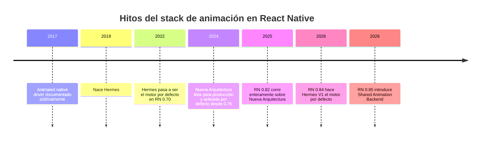
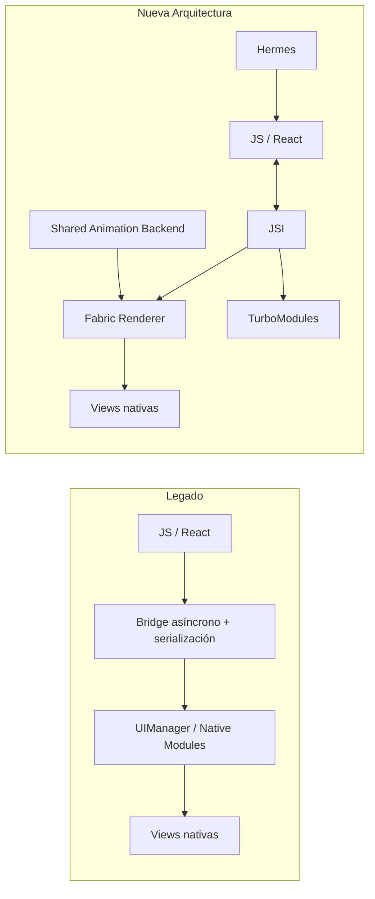
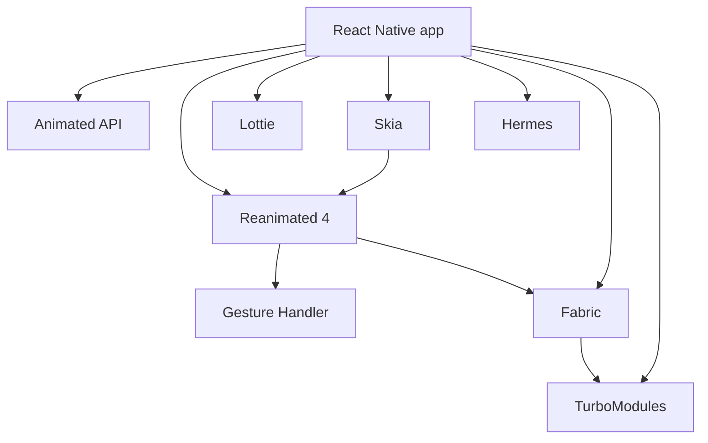

# Informe analítico sobre animaciones para apps y React Native en julio de 2026

> Investigación externa (deep research) aportada por el owner el 2026-07-25. Es material de referencia para decisiones de motion/UX; no gobierna estado ni backlog. Los marcadores de cita del formato original fueron removidos; las fuentes nombradas (React Native docs, Reanimated, Material 3, Apple HIG, papers) se conservan en el texto y en la sección de recursos.

## Aplicabilidad al stack EVA (nota del repo)

Contexto verificado contra `apps/mobile/package.json` al 2026-07-25:

- EVA mobile corre Expo SDK 54 + RN `0.81.5` con Nueva Arquitectura y Hermes. Los hitos RN `0.82`/`0.84` (Hermes V1) y `0.85` (Shared Animation Backend) que cita el informe **aún no aplican** a este repo; no diseñar asumiendo ese backend hasta subir de SDK.
- Ya tenemos el stack recomendado: `react-native-reanimated ~4.1.1`, `react-native-gesture-handler ~2.28.0`, `moti ^0.30.0` (transiciones declarativas, política en `apps/mobile/AGENTS.md`), `@shopify/react-native-skia 2.2.12` (partículas/gráficos), `expo-haptics`, `expo-linear-gradient` y `react-native-fast-confetti` para celebraciones.
- **No** usamos Lottie: motion ilustrado se resuelve con Moti/Reanimated/Skia. Agregar Lottie implicaría dependencia nativa nueva y build EAS; requiere decisión del owner.
- En web (Next + Tailwind v4) las reglas UX del informe aplican igual: preferir `transform`/`opacity`, animaciones breves e interrumpibles, y respetar `prefers-reduced-motion` (en RN: `useReducedMotion()` de Reanimated / `AccessibilityInfo.isReduceMotionEnabled()`).
- Regla de oro del informe adoptada como criterio de diseño: usar el motor más simple que cumpla el objetivo UX y medir en release build; la animación comunica estado (qué pasó, dónde, cuánto falta), no es decoración.

## Resumen ejecutivo

Fecha de corte: **25 de julio de 2026**. Bajo el supuesto de apps móviles de consumo general, sin restricción específica de plataforma y con objetivo iOS/Android, la conclusión principal es que la animación ya no debe tratarse como “ornamento”, sino como **infraestructura de UX**: sirve para comunicar causalidad, jerarquía, estado del sistema, continuidad espacial y respuesta a gestos. En 2026, las decisiones más sólidas para React Native pasan por **Nueva Arquitectura + Hermes + Reanimated 4 + Gesture Handler**, usando **Animated API** para casos simples, **Lottie** para motion de marca y estados ilustrados, y **Skia** o soluciones GL/canvas cuando el efecto exige dibujo de alto rendimiento o composición gráfica compleja.

Lo más importante no es “animar más”, sino **animar menos, mejor y con intención**. Las mejores animaciones móviles son breves, consistentes, proporcionales al cambio de estado, interrumpibles cuando hay gesto, y respetuosas de configuraciones de accesibilidad como **Reduce Motion**. Apple recomienda reducir o sustituir efectos problemáticos —por ejemplo, escalado, rotación, movimiento multi‑eje o simulaciones de profundidad— cuando pueden generar sensibilidad al movimiento; en React Native, esto hoy se puede detectar con `AccessibilityInfo.isReduceMotionEnabled()` y, en Reanimated, con `useReducedMotion()` o `ReducedMotionConfig`.

En rendimiento, la variable crítica sigue siendo evitar **jank**. React Native recuerda que el objetivo mínimo es sostener **60 fps** y, en displays modernos, cada frame tiene un presupuesto muy corto; además distingue entre FPS de JS y FPS de UI, porque muchas regresiones “se sienten” aunque el CPU no parezca saturado. En Reanimated 4, las animaciones corren por defecto en el **UI thread**, y su guía 2026 es muy clara: evitar leer shared values en el hilo JS, preferir propiedades no relacionadas con layout, no animar demasiados nodos simultáneamente y, cuando la escena es realmente gráfica, usar Skia en vez de cientos de componentes React animados por separado.

En el stack de React Native, julio de 2026 marca un punto de inflexión. La **Nueva Arquitectura** es la dirección estable: desde RN 0.76 viene activada por defecto, RN 0.82 fue la primera versión que corre enteramente sobre esa arquitectura, RN 0.84 hizo a **Hermes V1** el motor por defecto, y RN 0.85 introdujo el **Shared Animation Backend**, unificando internamente la ejecución de `Animated` y `Reanimated` y habilitando, entre otras cosas, la animación de props de layout con native driver bajo el nuevo backend. En términos prácticos: hoy conviene diseñar motion pensando en **Fabric/JSI/TurboModules**, no en el bridge clásico.

La recomendación operativa para equipos de producto es esta: usar **microinteracciones** para feedback local; **transiciones de pantalla** para continuidad espacial; **progreso/carga** para estado del sistema; **gestos + físicas** para interacción directa; **Lottie/SVG** cuando prime la expresividad vectorial; y **Skia/GL** cuando haya composición avanzada, shaders, dibujo procedural o muchas partículas/curvas. Evitar librerías legacy como `react-native-reanimated-bottom-sheet` como opción por defecto en proyectos nuevos: su propio README dice que “no está terminado”, mientras que `@gorhom/react-native-bottom-sheet` sigue activo, soporta accesibilidad y se alinea mejor con el ecosistema moderno de Reanimated/Gesture Handler.

## Marco conceptual y clasificación

La definición más útil para producto es que la animación **explica relaciones**. Material define las transiciones como animaciones cortas que conectan elementos o pantallas completas y que son fundamentales para una buena UX; NN/g define las microinteracciones como pares trigger‑feedback, es decir, pequeñas respuestas altamente contextuales a una acción del usuario o a un cambio del sistema. React Native, por su parte, subraya que la animación ayuda a comunicar movimiento físicamente creíble y el resultado de las acciones.

En apps móviles conviene clasificar las animaciones por **función UX** y por **tecnología de render**. Esa doble clasificación evita errores frecuentes: por ejemplo, usar Lottie para algo que debería ser una transición interactiva guiada por gesto, o usar SVG para una escena que en realidad necesita canvas/shaders.

| Tipo | Qué comunica | Ventajas | Desventajas | Casos de uso típicos | Fuentes |
|---|---|---|---|---|---|
| **Microinteracciones** | Confirmación, error, hover, press, toggle, like, favorito | Muy baratas en percepción; mejoran claridad y sensación de respuesta | Si se repiten demasiado se vuelven ruido o fatiga | Botón guardar, shake de error, toggle, reacción “me gusta” | |
| **Transiciones de pantalla** | Continuidad espacial entre estados o pantallas | Ayudan a construir modelo mental y jerarquía | Si son largas o teatrales, frenan el flujo | Push/pop, modal, cambio de tab, reveal/persistencia de elemento | |
| **Carga y progreso** | Estado del sistema y avance real o percibido | Reducen incertidumbre; pueden informar progreso real | Si “mienten”, erosionan confianza; si son interminables, frustran | Skeleton, spinner, barra de progreso, splash breve | |
| **Gestuales** | Manipulación directa de objetos y superficies | Se sienten nativas; elevan control y fluidez | Requieren interrupción elegante y buena física | Bottom sheets, swipe actions, drag, snap, pull-to-refresh | |
| **Basadas en físicas** | Inercia, masa, resorte, rebote, fricción | Más naturales ante input cambiante | Mal calibradas se sienten “gomosas” o infantiles | Drag, overscroll, reorder, snapping, sliders | |
| **Lottie y vectoriales exportadas** | Motion de marca o ilustración secuenciada | Muy expresivas; handoff claro diseño→desarrollo | Menos aptas para interacción compleja frame a frame | Empty states, onboarding, success/error, loaders ilustrados | |
| **SVG animado** | Íconos, trazos, gráficos y UI vectorial estructurada | Escalable y editable por nodos | Puede degradar listas/escenas complejas si se abusa | Íconos animados, charts simples, paths, logos | |
| **Canvas/Skia/WebGL** | Dibujo de alto rendimiento, composición de muchos objetos, shaders | Gran control y buen rendimiento para escenas gráficas | Mayor complejidad y costo de integración | Partículas, curvas, visualizaciones, dibujo custom, shaders | |
| **3D** | Profundidad, perspectiva, escena espacial | Alto impacto visual | Mayor costo cognitivo, técnico y de accesibilidad | Product showcase, configuradores, juegos, AR-like UI | |

Una regla práctica: **si la animación depende del dedo**, prioriza gesto + física; **si depende de narrativa visual**, considera Lottie; **si depende de dibujo intensivo**, usa Skia/GL; **si solo explica un cambio de estado**, casi siempre basta `transform`/`opacity` en `Animated` o Reanimated. Esa separación es consistente con la forma en que React Native, Reanimated, Gesture Handler, Skia y Lottie describen sus fortalezas.

## Qué hacer y qué no hacer en UX de animación

La mejor práctica transversal es que toda animación debe responder una de estas preguntas: **qué pasó, dónde pasó, cuánto falta, o cómo deshacerlo**. Material insiste en que la transición debe establecer un modelo espacial coherente, y los indicadores de progreso deben comunicar estado real del proceso. Cuando la animación no cumple ninguna de esas funciones, suele convertirse en ruido visual.

### Qué hacer

Primero, **usar movimiento para preservar continuidad**. Si un elemento cambia de ubicación, tamaño o jerarquía, conviene que el usuario vea “cómo llegó allí”. Estudios sobre transiciones en móvil muestran que las animaciones pueden ayudar a orientación y modelo mental; Material también las presenta como un nexo entre vistas o elementos. Un ejemplo concreto: al abrir el detalle de un producto desde una tarjeta, conservar la imagen, el título y la posición relativa en una transición breve resulta mejor que reemplazar toda la pantalla bruscamente.

Segundo, **preferir `transform` y `opacity` sobre propiedades de layout cuando sea posible**. React Native documenta que animar tamaño de imagen o ciertos cambios de layout puede castigar el FPS de UI, y Reanimated recomienda explícitamente preferir propiedades no ligadas al layout porque evitan recálculo de composición en cada frame. En otras palabras: para “mover”, usa `translateX/Y`; para “escalar”, usa `scale`; para “aparecer”, usa `opacity`; y deja `width/height/top/left/margin` para casos donde el cambio espacial real importa de verdad.

Tercero, **hacer las animaciones interrumpibles cuando hay gesto**. Android distingue entre animaciones de duración fija y animaciones basadas en físicas; las segundas se adaptan mejor cuando el objetivo cambia durante la interacción. En React Native, Gesture Handler fue diseñado precisamente para trasladar el reconocimiento de gesto al hilo de UI y evitar que la respuesta se degrade por bloqueos del hilo JS. Ejemplo: en un bottom sheet arrastrable, el usuario debe poder cambiar dirección o soltar a mitad del movimiento sin sentir “pelea” contra la interfaz.

Cuarto, **mantener un lenguaje de motion consistente**. Material 3 describe esquemas físicos y duraciones/easings como parte del sistema visual del producto. El error común es que cada pantalla “invente” su propio rebote, easing o velocidad. Una práctica madura es definir tokens o presets: por ejemplo, “feedback local”, “transición entre superficies” y “dismiss modal”, cada uno con su propia familia de timing.

### Qué no hacer

No uses animación para **ocultar lentitud real**. Un loader estilizado no compensa un backend lento; de hecho, los indicadores de progreso existen para informar estado, no para disfrazarlo. Si hay progreso real, muéstralo; si no lo hay, usa una señal honesta y corta, y evita bucles que parezcan “congelados”. Android además recomienda que la animación del splash no supere 1,000 ms en teléfonos.

No conviertas la interfaz en una feria de estímulos. Apple advierte que ciertos tipos de movimiento —escalado, giros, simulación de profundidad, movimiento multi‑eje— pueden causar distracción o malestar en personas con sensibilidad al movimiento. Incluso para quienes no son sensibles, demasiada oscilación, rebote o parallax reduce legibilidad y sensación de control. Una buena norma es: si la animación compite con el contenido principal, probablemente sobra.

No animes demasiados elementos a la vez en React Native. La propia guía de Reanimated da una regla de pulgar: no más de **100 componentes en Android de gama baja** y no más de **500 en iOS** si se animan de forma simultánea; si necesitas más complejidad visual, mejor pasar a un enfoque gráfico con Skia. Es una recomendación muy concreta, poco glamorosa, pero probablemente la más útil para evitar jank en producción.

No tomes como base paquetes que ya no encajan con el ecosistema actual. `react-native-reanimated-bottom-sheet` sigue siendo conocido y útil para mantener apps viejas, pero su propio README indica que “no está terminado”; en contraste, `@gorhom/react-native-bottom-sheet` declara soporte de accesibilidad, React Native Web y ramas mantenidas para Reanimated moderno. En 2026, la decisión prudente para proyectos nuevos suele ser **no arrancar** con el paquete legacy salvo necesidad de compatibilidad histórica.

### Ejemplos concretos de patrón bueno y malo

| Situación | Buen patrón | Mal patrón | Fuente |
|---|---|---|---|
| Like/favorito | Escala leve + opacidad breve + estado persistente | Explosión gráfica larga que bloquea el siguiente tap | |
| Cambio de pantalla | Persistir elementos clave para continuidad | Fundido total entre pantallas sin relación espacial | |
| Bottom sheet | Drag con snap y cancelación natural | Sheet que “teletransporta” o ignora velocidad del gesto | |
| Error de formulario | Shake sutil + mensaje accesible | Vibración visual excesiva o solo color sin texto | |
| Loading | Indicador claro, con progreso si existe | Spinner infinito decorativo sin contexto | |

## Accesibilidad, rendimiento y medición

La accesibilidad ya no es “un modo especial”: es una restricción de diseño de primer orden. React Native expone `AccessibilityInfo.isReduceMotionEnabled()` y el evento `reduceMotionChanged`; en iOS, además, existe preferencia por **cross‑fade transitions**; Reanimated ofrece `useReducedMotion()` y `ReducedMotionConfig`, que por defecto pueden desactivar o ajustar el comportamiento de las animaciones cuando el sistema indica sensibilidad al movimiento.

En iOS, Apple detalla que el objetivo de Reduced Motion es proteger a usuarios con sensibilidad extrema al movimiento y cita como especialmente problemáticos el giro, el escalado y las técnicas que simulan profundidad 3D. En Android, el sistema ofrece una escala global de duración para animadores y React Native documenta que `reduceMotionChanged` también se considera activado cuando la opción de **Transition Animation Scale** está en “Animation off”. En la práctica, si tu diseño depende de zoom, parallax o rotación para transmitir significado, debes ofrecer un fallback equivalente —normalmente **cross‑fade**, cambio de opacidad, o transición instantánea con feedback háptico/textual—.

En rendimiento, React Native sigue planteando el objetivo mínimo de **60 fps**, lo que da unos **16.67 ms** por frame a 60 Hz. También recuerda que hay dos tasas separadas: la de **JS** y la de **UI**, y que una animación controlada por el hilo JS puede congelarse si el árbol React se vuelve costoso en ese momento, mientras que transiciones que corren en el hilo de UI o en el sistema nativo resisten mejor esos bloqueos. Esta diferencia es el fundamento técnico detrás de la preferencia actual por Reanimated, gesto nativo y Nueva Arquitectura.

Android define el **jank** como frames omitidos porque la app no alcanza a renderizar a tiempo, y además separa “slow rendering” de “frozen frames”, indicando que ningún frame debería tardar más de **700 ms**. Apple, por su lado, mide **hitches** y considera que una tasa de hitch de **10 ms/s o menos** es buena, **25 ms/s o menos** es advertencia y **50 ms/s o menos** es crítica. Son métricas distintas, pero útiles para el mismo objetivo: convertir la sensación subjetiva de “esto tartamudea” en una señal operable.

### Métricas que sí conviene seguir

| Capa | Métrica | Por qué importa | Herramienta principal | Fuente |
|---|---|---|---|---|
| UI | FPS UI / dropped frames / hitch rate | Captura fluidez real percibida | Perf Monitor, Instruments, Xcode Organizer | |
| JS | JS FPS / commits / flame graph | Detecta renders o lógica costosa | React Native DevTools, React Profiler, Hermes profiling | |
| Android | Jank, slow/frozen frames | Problemas de renderización y frames omitidos | Android Vitals, JankStats, Profiler | |
| Startup | StartupTiming / Time to full display | La primera animación “mala” suele ser el arranque | Macrobenchmark, `reportFullyDrawn` | |
| Memoria/CPU | uso durante transición | A mayor presión, peor estabilidad en gama baja | Instruments / Android Studio Profiler | |
| UX | éxito de tarea, tiempo de tarea, errores, abandono | Valida si la animación ayuda o entorpece | test moderado/A‑B | |

Además de métricas técnicas, vale la pena testear si la animación mejora realmente la experiencia. Hay trabajos académicos que muestran efectos de las transiciones animadas sobre orientación espacial, percepción del tiempo y UX percibida. Para producto, esto implica una regla simple: si vas a defender una animación por “delight”, mídela también por **task success**, velocidad y errores, no solo por gusto del equipo.

### Estrategia de testing recomendada

Para React Native moderno, la combinación más útil en 2026 es: **Jest** para validar lógica y estilos animados con mocks de Reanimated; utilidades de **Gesture Handler** para simular streams de eventos; **release builds** para medir lo que el usuario realmente verá; **Instruments/XCTest** en iOS; y **Macrobenchmark/JankStats** en Android. Reanimated y Gesture Handler tienen guías oficiales de testing con Jest, mientras Apple y Android ya tratan explícitamente scrolls y animaciones como casos de benchmarking de primer nivel.

## Ecosistema React Native en julio de 2026

La tesis central del ecosistema actual es que las decisiones de animación dependen cada vez más de la arquitectura de RN. Desde 2024–2026, Meta empujó tres cambios clave: **Nueva Arquitectura por defecto**, **Hermes V1 por defecto** y **Shared Animation Backend**. Fabric mejora la interoperabilidad y el rendimiento del renderer; JSI reemplaza el bridge asíncrono para acceso directo entre JS y objetos nativos; y el nuevo backend de animación unifica internamente cómo `Animated` y `Reanimated` aplican actualizaciones.

Antes de mirar librerías, conviene visualizar la evolución del stack:



Los hitos del timeline anterior provienen del blog y documentación oficial de React Native.

También vale la pena entender el cambio de flujo entre el enfoque histórico y el actual:



El diagrama sintetiza cómo la Nueva Arquitectura reemplaza el bridge asíncrono con JSI, habilita Fabric/TurboModules y permite nuevas capacidades como layout sin saltos visibles y mejor interoperabilidad; a esto se suma el backend de animación compartido introducido en RN 0.85.

Finalmente, la relación práctica entre librerías y capas suele verse así:



La recomendación por defecto para 2026 es: **Animated** para casos simples, **Reanimated + RNGH** para interacción, **Lottie** para motion ilustrado, **Skia** para gráficos exigentes, y **Hermes/Fabric/TurboModules** como base de runtime/arquitectura.

### Comparativa de herramientas y librerías

**Nota metodológica:** la columna **tamaño** es cualitativa y se refiere al **overhead de integración/artefactos** más que a un benchmark exacto en KB. En componentes del core de RN, el costo marginal se considera bajo porque ya forman parte del runtime; en motores gráficos como Skia el costo de integración es mayor.

| Herramienta | Rendimiento | Facilidad de uso | Compatibilidad | Tamaño | Comunidad | Casos de uso recomendados | Fuente |
|---|---|---|---|---|---|---|---|
| **Animated API** | Buena para casos simples; muy buena si usa native driver; en RN 0.85 el nuevo backend amplía capacidades de layout | Alta | Core RN, iOS/Android | **Bajo** | **Core RN** | fades, transforms, progress simple, prototipos productivos | |
| **Reanimated 4** | Excelente; corre en UI thread por defecto y apunta a 120 fps | Media | Solo **Nueva Arquitectura**; soporta las tres últimas versiones de RN, incluida 0.86 en ramas 4.x recientes | **Medio** | Muy alta | gestos, transiciones complejas, worklets, interpolaciones, interacción avanzada | |
| **react-native-gesture-handler** | Excelente para toque y gesto nativos | Media | Soporta últimas minors; GH3 requiere RN 0.82+ | **Bajo‑medio** | Alta | pan, swipe, drag, detectors, interactions de alta fidelidad | |
| **Lottie React Native** | Buena para motion precompuesto; menos ideal para interacción física compleja | Alta | iOS, Android, Windows; web con dependencias de player | **Medio** y dependiente de assets | Muy alta | onboarding, empty states, success/error, branded motion | |
| **react-native-reanimated-bottom-sheet** | Rápido en su contexto original, pero desalineado con el stack moderno | Media | Pensado para Expo/RNGH/Reanimated antiguos; **legacy** | **Bajo‑medio** | Media, pero envejecida | solo mantenimiento de apps existentes | |
| **react-native-animatable** | Adecuado para animaciones declarativas sencillas; no es mi primera opción para UX crítica | Muy alta | Amplia, basada en patrones clásicos de RN | **Bajo** | Alta | presets rápidos, marketing UI, POCs, migraciones suaves | |
| **React Native Skia** | Muy alta para gráficos 2D complejos; integra directo con Reanimated | Media‑baja | Multiplataforma; en web usa CanvasKit WASM; integración moderna | **Alto** | Alta | canvas, partículas, charts custom, shaders, dibujo, escenas complejas | |
| **Hermes** | Mejora startup, memoria y tamaño frente a JSC en muchos casos | Alta porque es default | Core RN; default desde 0.70, Hermes V1 por defecto desde 0.84 | **Sin dependencia extra** | **Core RN** | base recomendada para casi cualquier app RN | |
| **Fabric** | Mejora pipeline de render, interoperabilidad y acceso sin serialización JSON | Media de adopción | Parte de la Nueva Arquitectura | **Sin dependencia extra** | **Core RN** | apps nuevas, componentes de UI exigentes, layout sin saltos | |
| **TurboModules** | Mejor interop JS↔nativo que bridge clásico | Media‑baja | Nueva Arquitectura y codegen | **Sin dependencia extra** | **Core RN** | módulos nativos de alto rendimiento o APIs propias | |

Si el caso es un **consumer app generalista**, mi matriz de decisión sería esta:  
**simple UI state changes** → `Animated`;  
**gestures / draggable / snapping / swipeables** → `Reanimated + Gesture Handler`;  
**motion de marca o ilustrado** → `Lottie`;  
**muchos elementos gráficos, curvas, shaders o visual analytics** → `Skia`;  
**cualquier app nueva** → Hermes + Nueva Arquitectura como baseline.

## Guía de implementación, snippets y QA

La secuencia más segura para implementar animación en React Native en 2026 es: **definir propósito UX → elegir clase de animación → elegir capa tecnológica → respetar Reduce Motion → medir en release build**. La mayoría de los problemas en producción no vienen del easing, sino de una mala elección de capa: usar Lottie donde debería haber gesto; usar layout animado donde bastaba un transform; o intentar mover demasiados componentes React en vez de dibujarlos.

### Implementación paso a paso

1. **Define el evento UX.** ¿Es feedback local, transición, carga, o manipulación directa?  
2. **Elige el motor mínimo suficiente.** `Animated` si basta; Reanimated si hay interacción compleja; Lottie si viene del equipo de motion; Skia si la escena es gráfica.  
3. **Diseña fallback accesible.** Reducir motion debe dar una alternativa funcional, no romper el flujo.  
4. **Usa propiedades baratas.** Prioriza `opacity`, `transform`, colores; evita tocar layout salvo necesidad real.  
5. **Hazlo interrumpible.** Especialmente si responde al dedo.  
6. **Prueba en release y en gama baja.** Dev mode y remote debugging engañan mucho sobre el rendimiento real.  
7. **Mide antes y después.** FPS, jank/hitches, startup, task success y errores.

### Snippet de React Native con Reanimated

El siguiente patrón es apropiado para una microinteracción de tarjeta o botón “favorito”: usa `scale` y `opacity`, respeta `Reduce Motion` y mantiene la lógica en shared values.

```tsx
import React from 'react';
import { Pressable, Text } from 'react-native';
import Animated, {
  useSharedValue,
  useAnimatedStyle,
  withSpring,
  withTiming,
  useReducedMotion,
} from 'react-native-reanimated';

export function LikeButton() {
  const liked = useSharedValue(0);
  const reduceMotion = useReducedMotion();

  const animatedStyle = useAnimatedStyle(() => {
    return {
      transform: [
        {
          scale: reduceMotion
            ? 1
            : 1 + liked.value * 0.12,
        },
      ],
      opacity: reduceMotion
        ? 1
        : 0.88 + liked.value * 0.12,
    };
  });

  const onPress = () => {
    if (reduceMotion) {
      liked.value = liked.value ? 0 : 1;
      return;
    }

    liked.value = liked.value ? 0 : 1;
    liked.value = withSpring(liked.value, {
      damping: 14,
      stiffness: 180,
    });
  };

  return (
    <Pressable onPress={onPress} accessibilityRole="button">
      <Animated.View
        style={[
          {
            paddingHorizontal: 16,
            paddingVertical: 10,
            borderRadius: 999,
            backgroundColor: '#111827',
          },
          animatedStyle,
        ]}
      >
        <Text style={{ color: 'white', fontWeight: '600' }}>
          {liked.value ? 'Guardado' : 'Guardar'}
        </Text>
      </Animated.View>
    </Pressable>
  );
}
```

Este patrón sigue la documentación actual de Reanimated sobre shared values, `useAnimatedStyle`, ejecución en UI thread y reduced motion. En producción, ajustaría el estado visible del texto con React state o derivación segura para evitar depender de lectura directa desde render.

### Snippet de React Native con Lottie

Este ejemplo sirve para un estado de carga o éxito ilustrado. La recomendación es usarlo donde la animación no dependa del gesto del usuario frame a frame.

```tsx
import React, { useRef, useEffect } from 'react';
import { View, AccessibilityInfo } from 'react-native';
import LottieView from 'lottie-react-native';

export function SuccessAnimation() {
  const ref = useRef<LottieView>(null);

  useEffect(() => {
    let mounted = true;

    AccessibilityInfo.isReduceMotionEnabled().then((enabled) => {
      if (!mounted) return;
      if (!enabled) {
        ref.current?.play();
      }
    });

    return () => {
      mounted = false;
    };
  }, []);

  return (
    <View
      accessible
      accessibilityLabel="Operación completada"
      style={{ width: 180, height: 180 }}
    >
      <LottieView
        ref={ref}
        source={require('./success.json')}
        loop={false}
        autoPlay={false}
        style={{ width: '100%', height: '100%' }}
      />
    </View>
  );
}
```

La propia librería documenta uso declarativo e imperativo, y React Native documenta la consulta del estado `Reduce Motion`. Para branded motion o success/error state, Lottie sigue siendo una de las mejores opciones cuando diseño quiere exportar JSON desde After Effects/Bodymovin y no necesitas una interacción física compleja.

### Alternativas nativas si aplica

Si una animación es extremadamente crítica o necesitas aprovechar capacidades específicas de plataforma, las alternativas nativas siguen siendo válidas:

**iOS con UIKit**

```swift
UIView.animate(withDuration: 0.25, animations: {
    cardView.transform = CGAffineTransform(scaleX: 1.04, y: 1.04)
    cardView.alpha = 1.0
}) { _ in
    UIView.animate(withDuration: 0.18) {
        cardView.transform = .identity
    }
}
```

**Android con ObjectAnimator**

```kotlin
val scaleX = ObjectAnimator.ofFloat(cardView, "scaleX", 1f, 1.04f, 1f)
val scaleY = ObjectAnimator.ofFloat(cardView, "scaleY", 1f, 1.04f, 1f)
scaleX.duration = 250
scaleY.duration = 250
scaleX.start()
scaleY.start()
```

UIKit ofrece animación de vistas y Core Animation se apoya en infraestructura acelerada por hardware; Android recomienda `ObjectAnimator` para la mayoría de animaciones de propiedades y permite controlar interpoladores y duración de manera directa.

### Checklist de QA para animaciones

- Verificar **Reduce Motion** activado/desactivado en iOS y Android.  
- Medir en **release build**, no solo en debug.  
- Revisar FPS JS/UI y jank/hitches en dispositivos de gama baja y gama media.  
- Validar que gestos sean interrumpibles y no se “peleen” entre sí.  
- Confirmar que loaders y progress indicators correspondan al estado real.  
- Probar listas largas, scroll y apertura/cierre de modales con animaciones concurrentes.  
- Auditar consumo de memoria/CPU durante transiciones visualmente ricas.  
- Revisar accesibilidad semántica: labels, foco, lectores de pantalla, mensajes de error no solo visuales.  

## Riesgos, mitigación y recursos prioritarios

El riesgo más subestimado es **confundir impacto visual con calidad de UX**. Una animación puede verse “premium” y aun así empeorar la app si aumenta el tiempo de tarea, bloquea un gesto, o provoca jank. El segundo riesgo es arquitectónico: seguir tomando decisiones de motion como si el bridge clásico fuera la referencia, cuando la trayectoria real del ecosistema ya es Fabric/JSI/Hermes/New Architecture.

Otro riesgo claro en React Native 2026 es el de **compatibilidad y librerías envejecidas**. Reanimated 4 soporta exclusivamente Nueva Arquitectura; Gesture Handler 3 requiere RN 0.82 o superior; y librerías legacy pueden seguir “funcionando” pero quedar fuera del camino principal de mantenimiento. La mitigación no es “actualizar todo ciegamente”, sino definir una política de stack: app nueva = stack moderno; app legacy = ruta de migración explícita.

También existe riesgo en efectos gráficos avanzados. `GLView` de Expo documenta que no funciona como se espera con remote debugging porque requiere llamadas nativas síncronas; Skia ofrece rendimiento muy alto, pero en web depende de CanvasKit WASM y eso ya da una idea de que no es una dependencia “liviana”. La mitigación es aislar estas capas a features que realmente lo necesiten, medirlas por separado y no meterlas como estándar de diseño para toda la app.

### Recursos y enlaces prioritarios

A continuación, los recursos que priorizaría para un equipo de diseño/ingeniería en julio de 2026. Cuando existe disponibilidad oficial regional o texto localizado la he favorecido, pero en React Native y motion avanzado la mayoría de las fuentes primarias siguen estando en inglés.

#### Documentación oficial indispensable

- **React Native Animations** — documentación base de `Animated` y `LayoutAnimation`; actualizada en junio de 2026.  
- **React Native Performance Overview** — guía oficial sobre frames, FPS JS/UI y problemas de rendimiento; actualizada el 7 de mayo de 2026.  
- **React Native AccessibilityInfo / Accessibility** — APIs para Reduce Motion, lectores de pantalla y señales de accesibilidad; junio–mayo de 2026.  
- **Reanimated 4 docs** — fundamentos, compatibilidad, accesibilidad, performance y testing; documentación viva en 2026.  
- **React Native Gesture Handler docs** — fundamentos, instalación, testing y compatibilidad moderna.  
- **Lottie React Native repo/docs** — instalación, plataformas soportadas y APIs declarativa/imperativa.  
- **React Native Skia docs** — animaciones, integración con Reanimated y consideraciones de tamaño web.  
- **About the New Architecture / Fabric / Turbo Native Modules** — material oficial para entender JSI, Fabric y TurboModules.  
- **Using Hermes** — base oficial para runtime y profiling.  

#### Artículos oficiales clave de 2023 a 2026

- **React Native 0.84 — Hermes V1 by Default** — 11 de febrero de 2026. Cambia el baseline de rendimiento del runtime.  
- **React Native 0.85 — New Animation Backend** — 7 de abril de 2026. Probablemente el cambio más importante para motion nativo/React Native de este período.  
- **React Native 0.82 — A New Era** — 8 de octubre de 2025. Primera versión enteramente sobre Nueva Arquitectura.  
- **New Architecture is here** — 23 de octubre de 2024. Documento fundacional para entender por qué cambió toda la conversación sobre rendimiento y animación.  
- **Material 3 Motion** y **Easing and duration** — guías oficiales del sistema de motion de Google.  
- **Apple HIG Motion** y **Reduced Motion evaluation criteria** — referencias oficiales para diseñar motion sin romper accesibilidad.  
- **Eliminate animation hitches with XCTest** — video oficial de Apple, disponible para Latinoamérica; útil para convertir motion en disciplina medible.  

#### Papers y estudios útiles para criterio de producto

- **Transition animations support orientation in mobile user interfaces** — evidencia sobre orientación/modelo mental.  
- **Animated UI transitions and perception of time** — clásico sobre cómo la animación afecta percepción temporal.  
- **Perceived User Experience of Animated Transitions in Mobile Applications** — foco explícito en UX percibida.  
- **Does Adding Visual Signifiers in Animated Transitions…** — 2025, sobre señalización visual dentro de transiciones.  
- **Study on the fluency experience of interactive animation** — 2025, sobre fluidez de animación interactiva y experiencia.  

#### Repositorios y referencias de implementación

- **software-mansion/react-native-reanimated** — estado del proyecto, compatibilidad y comunidad.  
- **software-mansion/react-native-gesture-handler** — repositorio oficial con compatibilidad RN 0.82+ para GH3.  
- **lottie-react-native/lottie-react-native** — repo oficial y ejemplos de integración.  
- **Shopify/react-native-skia** — referencia para canvas/graphics de alto rendimiento.  
- **gorhom/react-native-bottom-sheet** — alternativa moderna recomendada frente al paquete legacy.  

La conclusión final, con foco en producción, es sencilla: en 2026 gana el equipo que trata la animación como una combinación de **diseño sistémico + accesibilidad + profiling**, no como una capa cosmética. Si tuviera que dejar una sola regla para React Native hoy, sería esta: **usa el motor más simple que cumpla el objetivo UX, pero mide siempre en el runtime real de Nueva Arquitectura**.