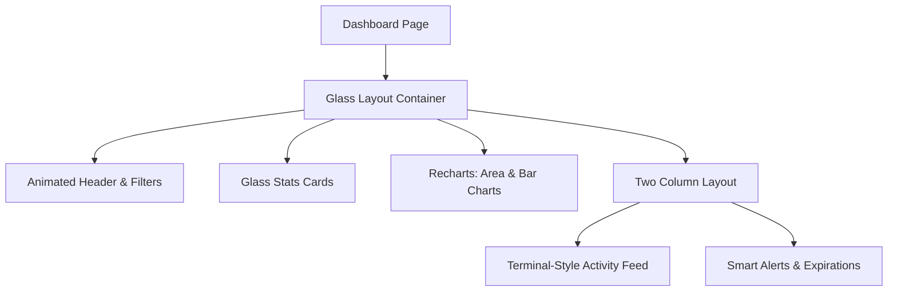

# Plan de Rework Total: Dashboard del Coach

Este plan detalla la transformación del Dashboard del Coach para alinearlo con la estética visual del Landing Page (Glassmorphism, modo oscuro/claro nativo) y mejorar su funcionalidad con métricas avanzadas y componentes interactivos.

## 1. Fase de Estética y Componentes Base (Glassmorphism)
- [ ] **Crear `src/components/ui/glass-card.tsx`**: Un contenedor base con `backdrop-blur-xl`, bordes semi-transparentes (`border-white/10`) y sombras suaves.
- [ ] **Crear `src/components/ui/glass-button.tsx`**: Botones con efectos de brillo y transiciones suaves de color.
- [ ] **Definir Paleta de Colores**: Asegurar el uso de los colores del landing (`#007AFF` para Primary, `#00E5FF` para Cyan, etc.) en variables de CSS.

## 2. Rework de la Cabecera (Control Center)
- [ ] **Header Animado**: Implementar el título con tipografía "Display" (font-black, tracking-tighter) y animaciones de entrada con Framer Motion.
- [ ] **Selector de Periodo**: Añadir un componente para filtrar datos por (Hoy, Esta Semana, Este Mes).

## 3. Estadísticas y Métricas de Rendimiento (Grid)
- [ ] **Rediseño de Stats Cards**: Aplicar el estilo de las tarjetas del landing, con iconos grandes en contenedores de color suave y flechas de tendencia.
- [ ] **Nuevas Métricas**:
    - **Adherencia Promedio**: Basado en logs de entrenamiento.
    - **Cumplimiento Nutricional**: Basado en macros registrados.
    - **Retención de Clientes**: Basado en renovaciones.

## 4. Visualización de Datos (Charts)
- [ ] **Gráfica de Crecimiento**: Una gráfica de área (Recharts) que muestre el crecimiento de alumnos activos.
- [ ] **Gráfica de Actividad Semanal**: Barras que muestren cuántas rutinas se han completado por día.
- [ ] **Donas de Cumplimiento**: Visualización circular para macros (similar al mockup del landing).

## 5. Feed de Actividad e Inteligencia
- [ ] **Actividad Estilo Terminal**: Rediseñar la lista de actividades para que parezca una terminal de comandos futurista dentro de un contenedor Glass.
- [ ] **Notificaciones Inteligentes**: Panel de alertas para clientes que llevan más de 3 días sin registrar nada.

## 6. Adaptabilidad y Modo de Luz
- [ ] **Ajuste de Sombras y Opacidades**: Asegurar que el efecto Glass se vea elegante en modo claro (blanco traslúcido con blur) y modo oscuro (negro traslúcido con brillo sutil).

## 7. Optimización de Backend
- [ ] **Queries Consolidadas**: Refactorizar las llamadas a Supabase en el `page.tsx` para usar una única transacción o Promise.all optimizado si es necesario añadir más datos.

---

### Diagrama de Arquitectura Visual

