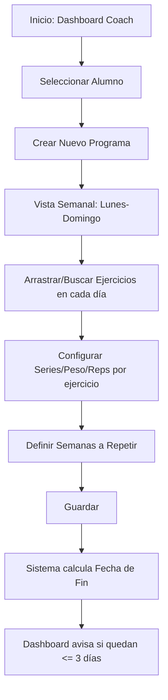

# Plan de Rediseño: Sistema de Entrenamiento Semanal

Este documento detalla la propuesta para optimizar la creación de planes de entrenamiento para coaches, permitiendo una gestión más rápida, visual y eficiente.

## 1. Cambios en el Esquema de Base de Datos (SQL)

Para soportar planes semanales y ciclos de repetición, se proponen los siguientes cambios:

### Nuevas Tablas / Columnas
- **`workout_programs`**: Una nueva entidad que agrupa la planificación de un periodo (ej. "Mes 1: Fuerza e Hipertrofia").
  - `id` (uuid, PK)
  - `client_id` (uuid, FK a `clients`)
  - `coach_id` (uuid, FK a `coaches`)
  - `name` (text) - Ej: "Mesociclo 1"
  - `weeks_to_repeat` (int) - Ej: 4 semanas.
  - `start_date` (date) - Fecha de inicio.
  - `end_date` (date) - Calculado automáticamente (`start_date` + `weeks_to_repeat` * 7 días).
  - `is_active` (boolean)
  - `created_at`, `updated_at`

- **`workout_plans` (Modificación o Reutilización)**:
  - Añadir `program_id` (FK a `workout_programs`) para vincular cada rutina a un programa semanal.
  - Añadir `day_of_week` (int) (1-7 para Lunes a Domingo) para saber en qué columna de la vista semanal se muestra.

## 2. Diseño de la Interfaz (UI/UX)

### Vista Desktop: "Tablero Semanal"
- **Header**: Selector de cliente, nombre del programa, selector de fecha de inicio y "Semanas a repetir".
- **Columnas**: 7 columnas (Lunes a Domingo).
- **Interacción**:
  - Cada columna tiene un buscador rápido (Command Palette style) para añadir ejercicios sin abrir modales.
  - Drag & Drop para mover ejercicios entre días o reordenarlos.
  - Click en ejercicio: Abre un panel lateral (Sheet) para editar Series, Reps, Peso, RPE, Tempo, etc.
- **Side Panel (Catálogo)**: Un catálogo colapsable a la derecha/izquierda con los ejercicios existentes, permitiendo arrastrarlos a cualquier día.

### Vista Móvil: "Scroll Horizontal de Días"
- **Header**: Similar al desktop pero compacto.
- **Navegación**: Tabs horizontales o scroll para Lunes-Domingo. Solo un día visible a la vez o vista de lista vertical separada por días.
- **Interacción**: Botón "+" flotante en cada día para añadir ejercicios desde el catálogo.

## 3. Lógica de Alertas y Dashboard

- **Cálculo de Expiración**: Un proceso (Edge Function o consulta en el dashboard) que compare `CURRENT_DATE` con `end_date` del programa activo del cliente.
- **Alertas**: En el dashboard del coach, se mostrará un widget de "Clientes con planes próximos a vencer" (3 días o menos).
- **Edición**: Los planes existentes se cargan en la vista semanal para ser modificados y guardados como una nueva versión o sobreescritos.

## 4. Flujo de Trabajo (To-Do List para Implementación)

### Fase 1: Base de Datos y API
- [ ] Crear migración SQL para `workout_programs` y actualizar `workout_plans`.
- [ ] Crear Server Actions para guardar el programa completo (transacción que guarde el programa y todos los días/bloques).
- [ ] Lógica para calcular `end_date`.

### Fase 2: Componentes de UI (Shadcn + Tailwind)
- [ ] Crear `WeeklyGridView`: Contenedor principal de 7 columnas.
- [ ] Crear `ExerciseSearchItem`: Buscador integrado en cada día.
- [ ] Implementar Drag & Drop (`dnd-kit`) para mover ejercicios entre días.
- [ ] Crear modal/panel de edición de detalles de ejercicio.

### Fase 3: Dashboard y Alertas
- [ ] Crear componente `PlanExpiryAlert` para el dashboard del coach.
- [ ] Modificar la vista de clientes para mostrar el estado del plan actual.

---

## Diagrama de Flujo del Coach

