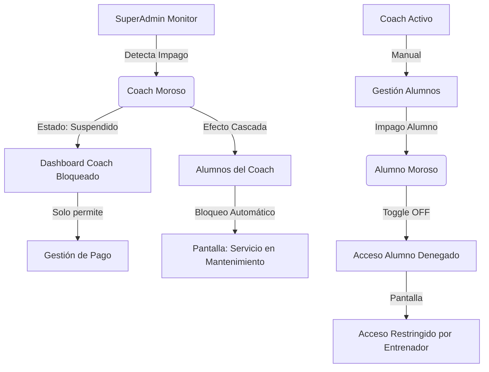

# LUDUS: Rediseño Gráfico y Experiencia de Usuario (UI/UX) - Master Plan de Lanzamiento

## 🏛️ Visión General: El Concepto "Ludus"
El término **Ludus** hace referencia a las escuelas de entrenamiento de la Antigua Roma, lugares de disciplina, entrenamiento extremo y forja de leyendas. El objetivo de este rediseño es transformar la aplicación actual en una **experiencia inmersiva, épica y altamente motivadora**. 

Queremos que el usuario sienta el peso de la disciplina y la recompensa del esfuerzo en cada interacción, combinando una estética imponente con una usabilidad impecable.

**Roles de la App:**
- **Coach:** El guía, estratega y mentor que define el camino.
- **Alumno:** El atleta en formación, dedicado a superar sus propios límites.

---

## 🎨 Paleta de Colores y Modos de Visualización

El diseño soportará tanto un **Modo Oscuro** (por defecto) como un **Modo Claro**, permitiendo a los usuarios elegir la atmósfera de su entrenamiento o adaptarse a su entorno (ej. entrenamiento al aire libre bajo el sol vs. gimnasio oscuro).

### **Modo Oscuro (Dark Mode Épico)**
Transmite seriedad, enfoque y el ambiente de preparación y concentración absoluta.
* **Fondo Principal (Obsidian Onyx):** `#121212` - Un negro profundo.
* **Superficies y Tarjetas (Arena Dust):** `#2A2A2A` o gradientes muy oscuros. Textos secundarios en tonos arena apagada (`#E5E4E2`).
* **Acentos Primarios:** 
    * **Sangre Carmesí (`#8B0000`):** Para alertas de intensidad o botones destructivos.
    * **Oro Imperial (`#D4AF37`):** Para botones principales (CTA), insignias y destacados.
* **Éxito (Laurel Green):** `#4B5320` para series completadas.

### **Modo Claro (Light Mode Monumental)**
Transmite claridad, energía matutina y la grandeza de los foros romanos a plena luz del día.
* **Fondo Principal (Mármol Blanco):** `#F8F9FA` - Un blanco roto, limpio y legible.
* **Superficies y Tarjetas (Piedra Caliza):** `#FFFFFF` con sombras suaves y extendidas (`box-shadow: 0 4px 20px rgba(0,0,0,0.05)`).
* **Textos:** Gris carbón oscuro (`#1E1E1E`) para máximo contraste.
* **Acentos Primarios:** 
    * **Rojo Óxido (`#A93226`):** Para alertas, más vibrante que en el modo oscuro.
    * **Bronce Pulido (`#B87333`):** Para botones principales (CTA), manteniendo la identidad clásica pero adaptada a fondos claros.
* **Éxito (Verde Oliva Claro):** `#7CB342` para confirmaciones de éxito.

---

## 🔤 Tipografía: La Fuerza en las Letras

* **Títulos y Encabezados (H1, H2):** Una fuente Serif clásica y monumental inspirada en las inscripciones romanas, como **Cinzel** o **Trajan Pro**.
* **Cuerpo de Texto e Interfaz (UI):** Una Sans-serif moderna, geométrica y de alta legibilidad como **Inter** o **Montserrat**.

---

## ⚙️ Accesibilidad y Configuración

El control y la personalización son esenciales para adaptar la experiencia a cada usuario, respetando sus preferencias y entorno.

1. **Selector de Idioma:** Se integrará un botón accesible globalmente para alternar entre **Inglés** y **Español**, estableciendo el **Español como idioma por defecto**.
2. **Menú de Configuración Avanzada (Tuerquita):** Accesible tanto para Coach como para Alumno, incluirá opciones vitales para la experiencia in-app:
   - **Control de Volumen de Alarmas:** Slider para ajustar la intensidad de los avisos sonoros.
   - **Automatización del Timer:** Toggle para activar o desactivar que las alarmas/cronómetros inicien automáticamente al entrenar o marcar una serie.
   - **Efectos Inmersivos:** Toggle para habilitar/deshabilitar animaciones complejas y sonidos de la interfaz (útil para dispositivos antiguos o preferencia personal).

---

## 🏛️ Disposición y Componentes UI: Arquitectura Monumental

1. **Tarjetas (Cards) de Entrenamiento:** Bordes rectos (sin redondear o *border-radius* mínimo de 2px), simulando bloques de piedra labrada. 
2. **Botón Principal de Entrenamiento:** Un botón masivo y llamativo. En lugar del típico "Start", el texto será **"Entrar a la Arena"** o **"Comenzar Batalla"**.
3. **Barra de Progreso:** Diseño visual de una columna llenándose o una línea de tiempo elegante que avanza a medida que se completa el entrenamiento.
4. **Modales de Alerta:** Fondos limpios pero con bordes acentuados en colores primarios (Oro/Bronce).

---

## ✨ Animaciones, Transiciones y Loaders (PWA & Web Desktop)

Las microinteracciones son lo que separa una app buena de una excepcional. Todo debe sentirse fluido y responsivo. **Es imperativo que todas las animaciones inmersivas y transiciones fluidas diseñadas para la PWA móvil se adapten perfectamente a la versión web de escritorio**, garantizando una experiencia premium unificada sin importar el dispositivo.

### **Loaders Nativos (PWA & Web)**
* **Animación de Inicio (Splash Screen):** El logo de Ludus formándose a partir de partículas de polvo dorado o arena que se arremolinan en el centro de la pantalla, resolviéndose rápidamente en el icono principal antes de mostrar el Dashboard. En web, esto actuará como un preloader épico.
* **Loaders Internos:** En lugar de spinners genéricos, usar una sutil barra de progreso superior (tipo YouTube/GitHub) en acento dorado, o un ícono minimalista de una mancuerna o escudo latiendo suavemente.

### **Transiciones (Smooth Transitions)**
* **Navegación del Menú:** Al cambiar entre secciones, el contenido actual se desvanecerá ligeramente hacia abajo (`fade-out-down`) y el nuevo aparecerá desde abajo (`fade-in-up`) en menos de 200ms.
* **Iniciar Entrenamiento:** Al pulsar "Entrar a la Arena", la pantalla hará un *zoom-in* sutil a la tarjeta del entrenamiento, oscureciendo el resto de la interfaz, dando paso a la vista activa. En escritorio, esto puede manifestarse como una expansión elegante del panel central.
* **Finalizar Entrenamiento (Celebración):** Lluvia de confeti minimalista en tonos dorados o efecto de "fuegos/llamas" sutiles.
* **Check-in de Series:** *Haptic feedback* (vibración en móviles) acompañado de un tachado suave o "corte visual".

---

## ⚡ Mejoras de UX Clave

### 1. Cronómetro del Alumno (Smart Timer)
Se rediseñará el concepto actual del cronómetro. En lugar de ser un simple contador que arranca automático y dictamina rígidamente el descanso, será el "compañero perfecto" de entrenamiento:
* **Control Total:** El alumno podrá pausarlo en cualquier momento.
* **Ajuste Rápido:** Botones de suma/resta (`+15s`, `-15s`) súper accesibles.
* **Modo Libre:** Capacidad de ignorar el tiempo sugerido por el Coach y usar el timer de forma independiente, asegurando que si el usuario necesita recuperar el aliento extra, el sistema no lo penalice visualmente ni lo presione.

### 2. Gestión y Personalización de Marca del Coach
El Coach debe sentir que su entorno en Ludus es **suyo**.
* **Gestión del "Slug" (Enlace PWA):** El *slug* del Coach (`app.ludus.com/c/slug-del-coach`) es la puerta de entrada de sus alumnos. **Regla de Negocio:** El cambio de *slug* se limitará drásticamente (ej. configúralo una vez, o permite el cambio solo 1 vez cada 3 o 6 meses). *Justificación:* Modificar el slug rompe instantáneamente la PWA instalada y los enlaces guardados de todos los alumnos de ese coach, causando un caos de soporte técnico y frustración.
* **Customización de la PWA:** El Coach tendrá una sección para **subir su propio Logo** (que reemplazará el branding general en el panel de sus alumnos) y seleccionar un **Color de Acento Principal** (que reemplazará el Oro/Bronce por defecto en botones y alertas para sus clientes).

---

## 🏆 Sistema de Gamificación

Los Alumnos ganarán niveles según su constancia, volumen de entrenamiento y rachas de cumplimiento. El Coach podrá ver el nivel de cada Alumno para premiar su esfuerzo.

**Niveles Estándar de Progresión:**
1. **Novato:** Iniciando el camino.
2. **Intermedio:** Demostrando constancia.
3. **Avanzado:** Atleta consolidado, dominando las rutinas.
4. **Experto:** Nivel de alto rendimiento y compromiso.
5. **Leyenda:** Otorgado tras un año de entrenamiento ininterrumpido o hitos excepcionales.

---

## 🌍 Landing Page Comercial

La página de inicio pública (Landing Page) será la principal herramienta de conversión para nuevos Coaches.
* **Secciones de "Showcase":** Debe incluir segmentos intercalados con *Mockups* de alta calidad de la aplicación (mostrando iPhones o pantallas limpias de escritorio).
* **Imágenes Clave:** 
  * Vista del Dashboard del Coach.
  * Vista PWA del Alumno en Modo Oscuro.
  * El creador de dietas y rutinas en acción.
* **Prueba Gratuita:** Destacar prominentemente la oferta de **15 días gratis** sin tarjeta de crédito.

---

## 💰 Planes y Precios (Coaches)

La plataforma ofrecerá diferentes *tiers* basados en la cantidad de alumnos activos.

| Tier (Alumnos) | Mensual (Base) | Trimestral (-10%) | Semestral (-15%) | Anual (-20%) |
| :--- | :--- | :--- | :--- | :--- |
| **1. Starter (5)** | $12.990 | $34.990 | $65.990 | $124.990 |
| **2. Bronce (15)** | $22.990 | $62.990 | $116.990 | $219.990 |
| **3. Plata (30)** | $34.990 | $94.990 | $179.990 | $334.990 |
| **4. Oro (60)** | $54.990 | $149.990 | $279.990 | $529.990 |
| **5. Ilimitado** | $79.990 | $214.990 | $409.990 | $769.990 |
| :--- | :--- | :--- | :--- | :--- |

---

## 🛡️ Administración y Gestión de Pagos (SuperAdmin)

Se integrará una vista exclusiva para el creador de la plataforma (**SuperAdmin**), diseñada para centralizar el control administrativo y financiero sin interferir en la experiencia de los Coaches.

*   **Panel de Control Global:** Dashboard administrativo con métricas de salud del negocio (Ingresos Mensuales Recurrentes - MRR, cantidad de Coaches activos vs. suspendidos, distribución de Tiers).
*   **Gestión de Coaches:** Listado maestro de todos los Coaches registrados, permitiendo filtrar por estado de pago, plan actual (Starter, Bronce, etc.) y fecha de vencimiento. Incluirá indicadores visuales (badges) para el estado de la cuenta (Activa, Suspendida, Período de Gracia).
*   **Monitoreo Financiero:** Capacidad de auditar el historial de pagos de cada Coach y gestionar excepciones o ajustes manuales en sus periodos de gracia.

---

## 💳 Panel de Suscripción del Coach

Dentro del Dashboard del Coach, se añadirá una sección de **"Premium"** o **"Suscripción"** para una autogestión transparente del servicio.

*   **Estatus de Cuenta:** Visualización clara del plan actual, fecha de próximo vencimiento y cantidad de alumnos utilizados vs. límite del Tier (mediante barras de progreso con estética Ludus).
*   **Historial de Transacciones:** Listado de pagos realizados con opción de visualizar recibos/facturas generadas.
*   **Pasarela de Pago (UX/UI Concept):** Botón prominente de "Renovar" o "Subir de Plan" que abrirá un flujo de pago (preparado para integración futura con MercadoPago), manteniendo la estética de Ludus (acento en Oro Imperial).

---

## 🛑 Lógica de Suspensión (Control de Acceso)

Para garantizar la sostenibilidad del modelo de negocio, se implementará un sistema de suspensión en cascada y gestión granular.

### 1. Suspensión por Coach Moroso (Cascada)
Si la suscripción de un Coach llega a su fecha de vencimiento sin un pago registrado:
*   **Acceso del Coach:** El Coach podrá entrar a su panel pero con funcionalidades limitadas solo a la gestión de su suscripción (bloqueo de edición de rutinas/dietas).
*   **Impacto en Alumnos:** Automáticamente, **todos los alumnos** vinculados a ese Coach perderán el acceso a la aplicación.
*   **Pantalla de Mantenimiento:** Al intentar ingresar, el alumno verá una pantalla con estética "Ludus" indicando: *"Servicio en mantenimiento por tu entrenador. Por favor, contacta con él para retomar tu entrenamiento"*. Esto incentiva que el Coach mantenga su cuenta al día.

### 2. Suspensión de Alumno (Gestión Manual del Coach)
El Coach tendrá el poder de gestionar el acceso individual de sus clientes basado en sus propios arreglos de pago externos.
*   **Interruptor de Estado (Toggle):** En la lista de clientes, cada alumno tendrá un *toggle* rápido de **"Activo / Inhabilitado"**.
*   **Bloqueo Individual:** Si un alumno no ha pagado su mensualidad al Coach, este puede inhabilitarlo con un clic. El alumno verá un mensaje indicando que su acceso ha sido restringido por su entrenador.
*   **Nota Futura:** Se contempla la automatización de este proceso mediante la integración de una pasarela de pago directa entre Alumno y Coach dentro de la plataforma.

### Flujo de Suspensión (Mermaid)

---

## � Mejoras Extra UI/UX (El Mejor Rediseño Posible)

1. **Gestos (Swipe Actions):** En listas de Alumnos, Ejercicios o Alimentos, implementar el gesto de deslizar (swipe) hacia la izquierda o derecha para revelar acciones rápidas.
2. **Skeleton Screens en lugar de Spinners:** Al cargar vistas pesadas, mostrar esqueletos estructurales (Skeleton UI) en lugar de un icono girando.
3. **Teclado Numérico Automático:** Al registrar pesos o repeticiones, el input debe invocar directamente el teclado numérico (`inputmode="decimal"`) del móvil.
4. **Estados Vacíos (Empty States) Amigables:** Si un Alumno no tiene rutinas asignadas, mostrar una ilustración estilizada y un mensaje motivador con un botón rápido de acción.
5. **Sticky Action Bars (Barras de Acción Fijas):** En formularios largos, los botones de "Guardar" deben flotar siempre visibles.
6. **Optimización de Contraste:** Asegurar que todos los acentos superen pruebas de contraste WCAG AA.
7. **Sonidos Sutiles (Opcional):** Incorporar breves efectos de sonido (desactivables vía la "Tuerquita") para hitos importantes.

---

