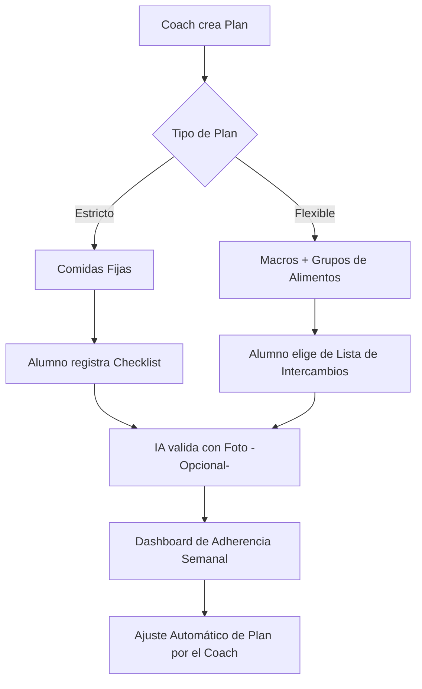

# Estrategia de Diferenciación: Módulo de Nutrición 🚀

Para superar a las aplicaciones de coaching actuales (como Trainerize, TrueCoach o MyFitnessPal), nuestro enfoque no debe ser solo "registrar comida", sino **"facilitar el cumplimiento y la comunicación Coach-Alumno"**.

Aquí presento un análisis de la situación actual y las propuestas de mejora divididas por impacto.

---

## 1. Análisis del Estado Actual
Actualmente, el sistema permite:
- ✅ Definir objetivos de macros diarios.
- ✅ Crear planes de comidas estructurados por el coach.
- ✅ Registro de cumplimiento mediante checklist por parte del alumno.
- ✅ Base de datos de alimentos con cálculo automático de macros.

**Limitación principal:** Es un sistema rígido. Si el alumno no come exactamente lo que el coach puso (ej. cambia pollo por pescado), el registro pierde precisión o se vuelve difícil de gestionar.

---

## 2. Propuestas de Valor (Diferenciadores)

### A. Flexibilidad Inteligente (Sistema de Intercambios)
*   **Concepto:** En lugar de "100g de Pollo", el coach puede definir "1 porción de Proteína Magra".
*   **Diferenciador:** Permitir que el alumno elija entre una lista de sustitutos aprobados por el coach que tengan macros similares, ajustando automáticamente la cantidad.
*   **Beneficio:** Menos fricción para el alumno, menos trabajo manual para el coach.

### B. Registro Visual y por IA
*   **Concepto:** Integrar Gemini Vision para que el alumno suba una foto del plato.
*   **Diferenciador:** La IA analiza la foto, estima las porciones y las compara con el plan del coach. "Parece que hay 150g de arroz y 100g de pollo, vas por buen camino".
*   **Beneficio:** El registro toma 5 segundos en lugar de 5 minutos.

### C. Dashboard de Adherencia Semanal (Voz del Coach)
*   **Concepto:** Una vista para el coach que no solo muestra "qué comió", sino un semáforo de adherencia semanal.
*   **Diferenciador:** Algoritmo que detecta patrones (ej. "El alumno siempre falla los macros los viernes").
*   **Beneficio:** Permite al coach intervenir proactivamente con datos reales.

### D. Lista de Compras Automatizada
*   **Concepto:** Botón que genera un PDF o una lista interactiva basada en el plan semanal.
*   **Diferenciador:** Organiza los alimentos por pasillo del supermercado.
*   **Beneficio:** Ahorro de tiempo real para el alumno en su vida diaria.

### E. Integración de Suplementación y Agua
*   **Concepto:** Un widget minimalista dentro del tracking de nutrición.
*   **Diferenciador:** Recordatorios push específicos para suplementos (ej. "No olvides tu Creatina post-entreno").

---

## 3. Hoja de Ruta de Implementación Sugerida

### Fase 1: Optimización de UX (Corto Plazo)
1.  **Sustituciones Rápidas:** Añadir un botón de "Cambiar alimento" que sugiera opciones con macros similares de la base de datos.
2.  **Seguimiento de Agua:** Implementar un contador simple de vasos de agua en `NutritionTracker.tsx`.
3.  **Notas de Comida:** Permitir que el alumno deje un comentario o foto en cada comida realizada.

### Fase 2: Inteligencia Artificial (Mediano Plazo)
1.  **Análisis de Fotos con Gemini:** Implementar un endpoint de API que procese fotos de comida y devuelva una estimación de macros.
2.  **Chat Nutricional:** Un bot que responda dudas rápidas sobre el plan (ej. "¿Puedo cambiar el arroz por quinoa hoy?").

### Fase 3: Ecosistema (Largo Plazo)
1.  **Generador de Lista de Compras.**
2.  **Integración con APIs de Supermercados** (ej. para pedir los ingredientes directamente).

---

## 4. Diagrama de Flujo: Experiencia de Usuario Ideal

---

*Documento generado por Roo (Architect Mode) para GymVScode.*
