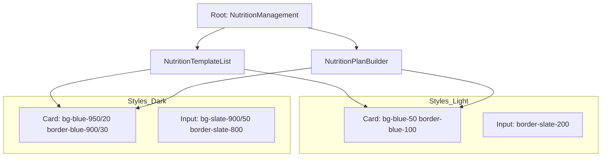

# Plan de Rediseño: Nutrición (Temas Claro/Oscuro)

## 1. Estilo General de Cards (Efecto Azulado)
Se aplicará un fondo sutil azulado a las tarjetas principales para darles profundidad y distinción.

- **Modo Claro:**
  - Fondo: `bg-blue-50/50` o `bg-slate-50/80`
  - Borde: `border-blue-100/50`
  - Sombra: `shadow-sm` con un tinte azul muy suave.
- **Modo Oscuro:**
  - Fondo: `dark:bg-blue-950/20` o `dark:bg-slate-900/40`
  - Borde: `dark:border-blue-900/30`
  - Hover: Resplandor sutil `dark:hover:border-blue-500/30`.

## 2. Componente: NutritionTemplateList.tsx
- **Cards de Plan:** Cambiar `bg-card` por la variante azulada.
- **Badges de Macros (Kcal, P, C, G):**
  - Actualmente usan colores fijos (orange, blue, emerald, purple). Se ajustarán las opacidades para que en modo oscuro el fondo sea más profundo y el texto más brillante.
  - Ejemplo Kcal: `bg-orange-500/10 dark:bg-orange-500/20` y `text-orange-600 dark:text-orange-400`.

## 3. Componente: NutritionPlanBuilder.tsx
- **Inputs y Textareas:**
  - Asegurar que `bg-background` en modo oscuro no sea un gris demasiado claro que choque con las cards.
  - Mejorar el contraste de los `Labels` (usar `text-foreground/80`).
- **Cards de Comida:**
  - Aplicar el mismo estilo azulado sutil.
  - El botón de eliminar (Trash) debe ser visible pero no disruptivo hasta el hover.
- **Badges de Grupos Guardados:**
  - Cambiar `bg-primary/5` por una variante que use `blue` explícitamente si se busca esa "tonalidad azul poco notable".

## 4. Mejoras de UX/UI
- **Efectos Hover:** Transiciones suaves en todas las cards (`transition-all duration-300`).
- **Consistencia:** Usar `glass-card` si ya existe un componente base, o emularlo con `backdrop-blur-sm` si encaja con el diseño actual.

## Mermaid Diagram de Estructura de Temas

