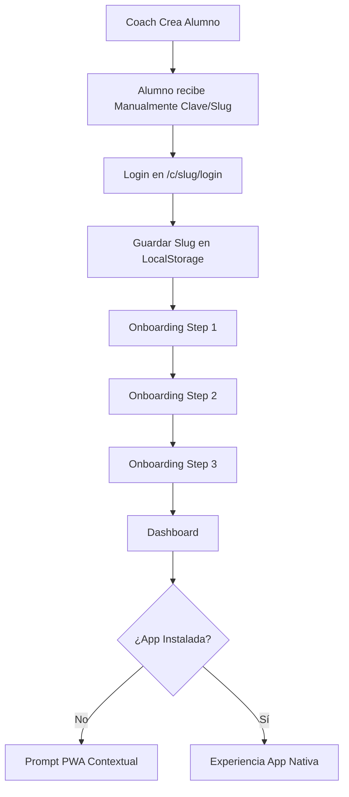

# Plan de Optimización UX: Onboarding y Acceso PWA

Este plan detalla las mejoras en la experiencia de usuario para alumnos y coaches, eliminando la dependencia del email como canal de comunicación y optimizando el acceso recurrente.

## Fase 1: Identidad y Acceso "Sticky Branding"
**Objetivo:** Que el alumno no necesite recordar su slug una vez que ha entrado la primera vez.

1. **Persistencia del Slug:**
   - Al loguearse en `/c/[coach_slug]/login`, guardaremos en `localStorage`: `last_coach_slug`, `coach_brand_name` y `coach_logo`.
2. **Redirección Inteligente en `/`:**
   - La página raíz (`src/app/page.tsx`) detectará si existen estos datos.
   - Si existen, mostrará una tarjeta de bienvenida: "Bienvenido de nuevo a [Brand Name]" con un botón directo al login del coach.
3. **Mejora del Login:**
   - Cambiar labels de "Email" a "Email / Usuario" para reflejar que es solo un identificador.

## Fase 2: Onboarding de Alta Retención (Multi-step)
**Objetivo:** Reducir la fatiga del usuario y asegurar que complete sus datos iniciales.

1. **Refactorización de `OnboardingForm.tsx`:**
   - **Paso 1: Biometría** (Peso, Altura, Edad).
   - **Paso 2: Objetivos y Disponibilidad** (Meta principal, Días de entreno).
   - **Paso 3: Salud y Seguridad** (Lesiones, Condiciones médicas).
2. **Estado Temporal:**
   - Guardar el progreso de cada paso en `localStorage` por si se recarga la página.
3. **Feedback Visual:**
   - Barra de progreso superior.
   - Animación de éxito al finalizar.

## Fase 3: Motor PWA Multi-Plataforma
**Objetivo:** Incentivar la instalación sin ser invasivo, adaptándose a las limitaciones de iOS.

1. **Detección Avanzada en `InstallPrompt.tsx`:**
   - Ocultar si `window.matchMedia('(display-mode: standalone)')` es verdadero.
   - Detectar SO (Android vs iOS).
2. **Flujo Android:**
   - Capturar `beforeinstallprompt`.
   - Mostrar banner "Instalar [Brand Name]" tras 30s de actividad o al terminar el onboarding.
3. **Flujo iOS (Safari):**
   - Mostrar Tooltip animado que apunta al botón de "Compartir" (índice real de Safari).
   - Instrucción clara: "Toca [icon] y luego 'Añadir a pantalla de inicio'".
4. **Persistencia del Prompt:**
   - Si el usuario lo cierra, no volver a mostrar en 7 días (`localStorage`).

---

## Preguntas de Control
- ¿Te gustaría que usemos los colores de marca del coach (definidos en su configuración) para el botón de instalación?
- ¿Quieres que el coach reciba una notificación (o flag en su panel) cuando un alumno complete su onboarding?

---

## Mermaid Workflow

