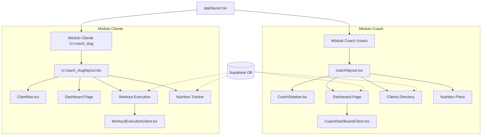
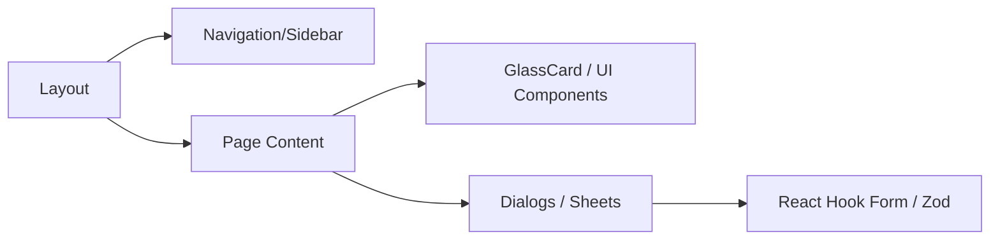

# Estructura Jerárquica y Flujo de Datos - GymApp JP

Este documento detalla la arquitectura de la aplicación, las conexiones entre componentes y los datos que solicitan a la base de datos (Supabase).

## 1. Arquitectura de Alto Nivel

La aplicación se divide en dos módulos principales: **Coach** (Gestión) y **Client** (Ejecución). Utiliza Next.js App Router con una clara separación entre Server y Client Components.

## 2. Conexiones y Solicitud de Datos

### A. Módulo Coach (Dashboard Principal)
El dashboard del coach es un Server Component que orquestra múltiples consultas en paralelo antes de pasar los datos al cliente.

| Componente | Conecta con | Datos Solicitados (Tablas) | Propósito |
| :--- | :--- | :--- | :--- |
| `CoachDashboardPage` | `MainDashboardData` | `auth.getUser()` | Autenticación del coach |
| `MainDashboardData` | `CoachDashboardClient` | `clients`, `check_ins`, `workout_programs` | Resumen de actividad, crecimiento de alumnos y programas por vencer |
| `StatsCards` | N/A | `clients`, `workout_plans` | Contadores totales y promedios de adherencia |

### B. Módulo Cliente (Ejecución de Entrenamiento)
Diseñado para una experiencia fluida en dispositivos móviles.

| Componente | Conecta con | Datos Solicitados (Tablas) | Propósito |
| :--- | :--- | :--- | :--- |
| `WorkoutExecutionPage` | `WorkoutExecutionClient` | `workout_plans`, `workout_blocks`, `exercises` | Obtener la rutina del día con todos sus ejercicios y detalles |
| `LogSetForm` | `actions.ts` | `workout_logs` (Insert/Update) | Registrar las series completadas (repeticiones, peso, RPE) |

### C. Módulo Cliente (Nutrición)
| Componente | Conecta con | Datos Solicitados (Tablas) | Propósito |
| :--- | :--- | :--- | :--- |
| `NutritionTracker` | `actions.ts` | `nutrition_plans`, `nutrition_meals`, `food_items`, `foods` | Mostrar el plan de alimentación y permitir el registro de ingestas |

## 3. Jerarquía de Componentes UI (Comunes)

## 4. Entidades Principales de la Base de Datos
- **coaches**: Perfil del entrenador, marca y configuración.
- **clients**: Alumnos vinculados a un coach.
- **workout_programs**: Contenedores de planes de entrenamiento.
- **workout_plans**: Rutinas específicas (ej. "Lunes - Empuje").
- **workout_blocks**: Ejercicios individuales dentro de un plan.
- **check_ins**: Registros semanales de progreso (peso, fotos, notas).
- **nutrition_plans**: Macros y estructura de comidas.
